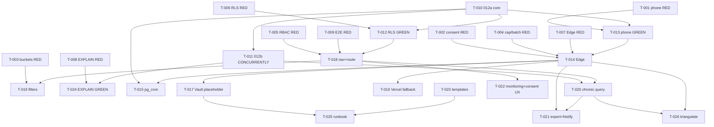

# Tasks — WhatsApp Pastoreo Notifications

## Review Workload Forecast

| Field | Value |
| ------- | ------- |
| Estimated changed lines | 1100–1350 (additions + deletions) |
| 400-line budget risk | High |
| Chained PRs recommended | Yes |
| Suggested split | PR1 infra+phone → PR2 Edge+cron → PR3 Pastoreo UI (stacked-to-main) |
| Delivery strategy | ask-on-risk |
| Chain strategy | stacked-to-main |

```text
Decision needed before apply: No
Chained PRs recommended: Yes
Chain strategy: stacked-to-main
400-line budget risk: High
```

> Forecast rationale: 3 migrations (012a/b/c) + Vault/RPC + 1 Edge Function (Deno, ~250 LOC) + 1 Vercel Route Handler + phone helper + 5 Pastoreo components + RBAC/nav/vercel.json + 8 Vitest suites + 3 Playwright specs + docs. Even with reuse (SheetJS, shadcn), total touches ~17 files / ~1200 lines. Single PR exceeds 400-line review budget. `stacked-to-main` is the default per preflight (chain strategy undefined → stacked-to-main). Each PR below is autonomous, verifiable, and rollback-bounded. Exception path is `size:exception` only if owner explicitly opts for single-PR.

---

## 1. Overview & Sequencing

### Execution order (dependency-ordered, additive, no destructive DDL)

```
Phase 0  RED — failing tests first (strict_tdd true)
  └─> Phase 1  012a core DDL  (members/profiles columns + notification_log + app_settings + audit trigger + Vault extension)
        └─> Phase 1b 012b indexes CONCURRENTLY  (separate transaction — lock- category)
              └─> Phase 1c 012c RLS  (ENABLE RLS + TO authenticated USING + REVOKE/GRANT) — blocks Pastoreo reads & Edge writes
                    └─> Phase 2  Phone helper + Vault secrets placeholder (D2) — blocks Edge + cron + Pastoreo edit UX
                          └─> Phase 3  Edge Function send-whatsapp + pg_cron daily-digest + Vercel fallback /api/cron/daily-digest
                                └─> Phase 4  Pastoreo route /(dashboard)/pastoreo (Server/Client split, filters, chronic window function, export, Notify)
                                      └─> Phase 5  Templates drafts + hardening + docs + EXPLAIN ANALYZE gate
```

### Key sequencing invariants (from spec §Data Contracts, design §2/10, supabase-postgres-best-practices)

- **Migrations are additive + nullable/defaulted** — safe to apply on prod with live traffic. `sex` nullable, `whatsapp_opt_in DEFAULT false`, `age_years GENERATED ALWAYS AS (...) STORED`. No data backfill required.
- **Indexes CONCURRENTLY must NOT be in the same transaction as 012a DDL.** Supabase CLI wraps each migration file in a transaction by default — `012b` is a dedicated file/migration that runs outside transaction or via `psql` with `statement_timeout` large. Covers `query-partial-indexes` and `lock-concurrently` best practices.
- **Views if any MUST be `WITH (security_invoker = true)`** (Postgres 15). RLS policies MUST use `TO authenticated USING (SELECT public.user_role() ...)`, never bare `TO authenticated` (BOLA/IDOR), and never `SECURITY DEFINER` without `auth.uid()` guard + non-public schema.
- **Vault secrets are placeholder-configurable without migration** — D2 injection is Vault + `app_settings` + `supabase secrets set` + Edge redeploy only.
- **Strict TDD:** every GREEN task below has a preceding RED task; `npx vitest` + `npx playwright test` must stay green after each PR.

### Change boundaries

| PR slice | Branch | Base | Goal | Approx. lines | Verification | Rollback |
| ---------- | -------- | ------ | ------ | --------------- | -------------- | ---------- |
| PR1 | `feat/whatsapp-pastoreo-infra` | `main` | 012a/b/c + Vault helper + phone helper + deps | ~320–380 | `supabase db reset` + RLS unit + E.164 unit + `supabase db advisors` | `DROP INDEX CONCURRENTLY` + `DROP TABLE notification_log` + `ALTER TABLE ... DROP COLUMN` (all additive) + `app_settings` delete |
| PR2 | `feat/whatsapp-pastoreo-edge-cron` | `main` (after PR1) | Edge Function + pg_cron + Vercel fallback | ~340–400 | Edge contract tests (mocked Graph API) + cap/kill-switch + dry_run + cron simulation | `cron.unschedule('daily-digest')` + `supabase functions delete` + revert `vercel.json` |
| PR3 | `feat/whatsapp-pastoreo-ui` | `main` (after PR2) | Pastoreo route + components + nav + export + monitoring strip | ~380–420 | Component + Playwright (403 for server, filters, chronic, export, Notify) + EXPLAIN gate | Revert route + nav; no DB rollback |

All PRs use `stacked-to-main` — each merges to `main` in order. Fix-forward is allowed; full chain revert is `git revert` per PR (no feature-branch accumulation).

---

## 2. Tasks — RED (failing tests first, strict_tdd)

> RED tasks create failing tests before GREEN implementation. They MUST land first (or as first commit in each PR) and MUST fail for the right reason (missing column/table/function/index/policy).

- [x] T-001 RED — Vitest unit: phone E.164 helper contract (`src/lib/phone/__tests__/normalize.test.ts`) <!-- sdd-owner: implementation -->
  - **Description:** Create failing suite for `src/lib/phone/normalize.ts` wrapper around `libphonenumber-js` (`parsePhoneNumberFromString(value,'CO')` → `format('E.164')`). Cases: valid `+573001234567`, valid with spaces/dashes, `NULL`/empty, invalid `+57 300-abc`, landline `+5712345670` (invalid for WA?), `+1...` (non +57 but E.164), `CO` default region without `+`. Assert `^\+[1-9]\d{7,14}$` and `+57` prefix check.
  - **Acceptance:** `npx vitest run src/lib/phone/__tests__/normalize.test.ts` fails with `Cannot find module '@/lib/phone/normalize'`; after GREEN passes all cases.
  - **Dependencies:** none.
  - **Estimate:** S
  - **Trace:** Spec US1 Invalid phone, Data Contracts §6.1; Design §1.3/§3.5/§7.2.

- [x] T-002 RED — Vitest unit: consent/Ley 1581 triple gate helper (`src/lib/whatsapp/__tests__/consent-gate.test.ts`) <!-- sdd-owner: implementation -->
  - **Description:** Failing tests for `canSendWhatsapp({ optIn, optOutAt, consentRows })` triple gate: `whatsapp_opt_in=false`→block, `opt_out_at NOT NULL`→block, no `consent_records whatsapp_messaging`→`skipped_no_consent`, all pass→allow. Staff variant (`profiles.whatsapp_opt_in`). Mock `consent_records` lookup.
  - **Acceptance:** Fails before helper exists; passes after GREEN implements gate. Covers spec Ley 1581 §Gate.
  - **Dependencies:** none.
  - **Estimate:** S
  - **Trace:** Spec Requirement Ley 1581, US1 Consent gate; Design §7.1.

- [x] T-003 RED — Vitest unit: age bucket + sex + birthday helpers (`src/lib/pastoreo/__tests__/buckets.test.ts`) <!-- sdd-owner: implementation -->
  - **Description:** Failing tests for `age_bucket CASE` (5→0-12, 15→13-17, 22→18-25, 30→26-35, 40→36-50, 60→51+, NULL→NULL), `sex` bucket including NULL→"No especificado", `is_leap_year(y)` helper, Feb29 on Feb28 non-leap inclusion, digest grouping `"Ana (40), Luis (22)"` with `age_today = EXTRACT(YEAR FROM age(birthday))::int` on Bogota date.
  - **Acceptance:** Fails before helpers exist; passes after GREEN.
  - **Dependencies:** none.
  - **Estimate:** S
  - **Trace:** Spec US3 Filters, US2 Feb29, Pastoreo Queries; Design §5.3/§6.2.

- [x] T-004 RED — Vitest unit: cap + kill-switch + idempotency + batching helpers (`src/lib/whatsapp/__tests__/cap-batch.test.ts`) <!-- sdd-owner: implementation -->
  - **Description:** Failing tests for monthly cap (`COUNT(*) WHERE status='sent' AND date_trunc('month',sent_at)=...` ≥900→`skipped_cap`, 800→alert), `whatsapp_enabled=false`→early return, idempotency check against dedup keys `(session_id,member_id,kind)` and `(member_id,recipient_profile_id,kind,notification_date)`, batch chunking 120→50/50/20.
  - **Acceptance:** Fails before helpers; passes after GREEN.
  - **Dependencies:** none.
  - **Estimate:** S
  - **Trace:** Spec API Error taxonomy, Data Contracts dedup indexes, API Batching; Design §3.3/§3.4/§8.3.

- [x] T-005 RED — Vitest unit: Pastoreo RBAC helper (`src/lib/rbac/__tests__/guards.test.ts` — extend) <!-- sdd-owner: implementation -->
  - **Description:** Failing tests for new `canViewPastoreo(role)`: `super_admin=true`, `leader=true`, `server=false`, `anon=false`. Also `canManageWhatsappSettings` (`super_admin` only).
  - **Acceptance:** Fails before helper exists; passes after GREEN.
  - **Dependencies:** none.
  - **Estimate:** S
  - **Trace:** Spec Actors matrix; Design §5.7.

- [x] T-006 RED — Vitest RLS contract tests (`supabase/tests/whatsapp_pastoreo_rls.test.ts` or `src/__tests__/rls/whatsapp_pastoreo.test.ts` per repo pattern) <!-- sdd-owner: implementation -->
  - **Description:** Failing RLS tests against local Supabase (`supabase start`): `notification_log SELECT` by `super_admin`→rows, `leader`→rows, `server`→0 rows, `anon`→0/401; `notification_log INSERT/UPDATE` by `authenticated`→0 rows (service_role only); `app_settings UPDATE whatsapp_%` by `leader`→0, `super_admin`→1; `security_invoker` view if introduced → `server` denied on birthday/sex aggregations. Uses `supabase-js` with anon/authenticated keys per `supabase-postgres-best-practices` `security-rls`.
  - **Acceptance:** Fails before RLS policies exist (table missing or RLS off); passes after 012c.
  - **Dependencies:** none (run against ephemeral DB; will be skipped in CI until 012a applied).
  - **Estimate:** M
  - **Trace:** Spec Data Contracts RLS, Requirement Actors; Design §2.8.

- [x] T-007 RED — Vitest Edge contract tests skeleton (`supabase/functions/send-whatsapp/__tests__/handler.test.ts`) <!-- sdd-owner: implementation -->
  - **Description:** Failing Edge contract tests mocking `fetch` for Graph API: happy path `absence` (consent+phone ok → POST `graph.facebook.com` with `absence_followup`, wamid→`sent`), kill switch, missing creds D2, cap exceeded, invalid phone, no consent, duplicate (`skipped_duplicate`), auth 401/403. Assert idempotency check before provider call and structured logs.
  - **Acceptance:** Fails before function exists; passes after T-014 GREEN (mocked fetch, no real network).
  - **Dependencies:** T-001–T-004 helpers as mocks.
  - **Estimate:** M
  - **Trace:** Spec API Contract, Cron & Scheduling; Design §3.

- [x] T-008 RED — Vitest EXPLAIN gate skeleton (`src/lib/pastoreo/__tests__/explain.test.ts`) <!-- sdd-owner: implementation -->
  - **Description:** Failing test that runs `EXPLAIN (FORMAT JSON) SELECT ...` for birthday daily scan and chronic window query and asserts plan contains `Index Scan`/`Index Only Scan` not `Seq Scan`. Requires local Supabase; skipped if DB unavailable.
  - **Acceptance:** Fails before indexes exist (Seq Scan); passes after 012b.
  - **Dependencies:** none.
  - **Estimate:** S
  - **Trace:** Spec Pastoreo Queries Indexes; Design §2.7/§5.9.

- [x] T-009 RED — Playwright E2E skeletons (`e2e/pastoreo.spec.ts`) <!-- sdd-owner: implementation -->
  - **Description:** Failing E2E (chromium, firefox per config): `server`→`/(dashboard)/pastoreo` 403/redirect, `leader`→Renders Resumen + filters mutate URL, chronic table respects threshold, export downloads `.xlsx`, birthday tab shows completeness warning, monitoring strip shows mocked `notification_log` counts. Seeded via Supabase local.
  - **Acceptance:** Fails before route exists (404); passes after PR3.
  - **Dependencies:** none.
  - **Estimate:** M
  - **Trace:** Spec US3 scenarios, Traceability C4/C8; Design §5/§11.4.

---

## 3. Tasks — GREEN (implementation)

### PR1 — Infra + Phone (T-010 → T-013)

- [x] T-010 GREEN — Migration 012a core DDL (`supabase/migrations/012a_whatsapp_pastoreo_core.sql`) <!-- sdd-owner: implementation -->
  - **Description:** Create idempotent additive migration (guards `IF NOT EXISTS`): `ALTER TABLE members ADD COLUMN sex TEXT CHECK (sex IN ('M','F','other','prefer_not_to_say'))`, `ADD COLUMN whatsapp_opt_in BOOLEAN NOT NULL DEFAULT false`, `ADD COLUMN whatsapp_opt_out_at TIMESTAMPTZ`, `ADD COLUMN age_years INT GENERATED ALWAYS AS (EXTRACT(YEAR FROM age(birthday))::int) STORED`; `ALTER TABLE profiles ADD COLUMN whatsapp_number TEXT CHECK (whatsapp_number ~ '^\+[1-9]\d{7,14}$')`, `ADD COLUMN whatsapp_opt_in BOOLEAN NOT NULL DEFAULT false`; `CREATE TABLE notification_log` per spec §6.3 (UUID PK, FK SET NULL, kind/channel/template_name/status CHECK, notification_date, provider_message_id, error, created_at/sent_at/created_by) with `COMMENT ON`; `INSERT app_settings` keys (`whatsapp_enabled='true'`, `whatsapp_monthly_cap='900'`, `whatsapp_monthly_alert_at='800'`, `whatsapp_phone_number_id=''`, `whatsapp_cron_driver='pg_cron'`, `pastoreo_chronic_threshold='3'`, `pastoreo_chronic_lookback_days='90'`) `ON CONFLICT DO NOTHING`; `CREATE EXTENSION IF NOT EXISTS supabase_vault SCHEMA vault`; add `audit_notification_log` trigger `AFTER INSERT OR UPDATE OR DELETE ... EXECUTE FUNCTION log_mutation()` (existing `SECURITY DEFINER SET search_path=''`). Follow existing migration style (011 as template). Document `AT TIME ZONE 'America/Bogota'` invariant in comments. Run `supabase db advisors` after.
  - **Acceptance:** `supabase db reset` succeeds; `\d members` shows new columns; `age_years` is `GENERATED STORED`; `notification_log` exists with checks; `app_settings` keys present; `vault` extension present; RLS not yet (012c). No `SECURITY DEFINER` without guard. `npx tsc --noEmit` passes.
  - **Dependencies:** T-001–T-006 RED (drives schema); 011 migration as style ref.
  - **Estimate:** M
  - **Trace:** Spec §Data Contracts 6.1–6.3, Vault, app_settings; Design §2.1–2.6/§10.1.

- [x] T-011 GREEN — Migration 012b indexes CONCURRENTLY (`supabase/migrations/012b_whatsapp_pastoreo_indexes.sql`) <!-- sdd-owner: implementation -->
  - **Description:** Dedicated file for `CONCURRENTLY` (non-transactional): `idx_members_birthday_month_day` expression partial, `idx_attendance_member_session`, `idx_attendance_session`, `idx_sessions_session_date`, `idx_members_sex`, `uq_notification_log_dedup` partial unique, `uq_notification_log_birthday`, `uq_notification_log_birthday_recipient`, `idx_notification_log_sent_at_status` — all `IF NOT EXISTS` + `WHERE deleted_at IS NULL` / partial predicates per spec. MUST be separate transaction; set `statement_timeout` large; verify via `EXPLAIN ANALYZE` expectation (Index Scan not Seq Scan at 1k members). Follows `supabase-postgres-best-practices` `lock-concurrently` + `query-partial-indexes`.
  - **Acceptance:** `\di` shows 8 indexes; `EXPLAIN (FORMAT JSON)` for birthday scan shows `Index Scan` on `idx_members_birthday_month_day`; no `Seq Scan` on hot paths. `supabase db advisors` no missing-index warnings.
  - **Dependencies:** T-010.
  - **Estimate:** M
  - **Trace:** Spec Indexes, Data Contracts; Design §2.7.

- [x] T-012 GREEN — Migration 012c RLS (`supabase/migrations/012c_whatsapp_pastoreo_rls.sql`) <!-- sdd-owner: implementation -->
  - **Description:** `ALTER TABLE notification_log ENABLE ROW LEVEL SECURITY`; `REVOKE ALL FROM PUBLIC, anon`; `GRANT SELECT TO authenticated`; `CREATE POLICY notification_log_select FOR SELECT TO authenticated USING ((SELECT public.user_role()) IN ('super_admin','leader'))`; no INSERT/UPDATE/DELETE for authenticated (service_role bypasses). If Pastoreo view introduced (`v_pastoreo_stats`) add `WITH (security_invoker=true)` and predicate denying `server` on birthday/sex. Verify `TO authenticated USING` pattern (not bare `TO authenticated`). Run `supabase db advisors` for RLS.
  - **Acceptance:** RLS tests T-006 pass (server=0 rows, anon=0); `supabase db advisors` no RLS warnings; `anon` cannot SELECT.
  - **Dependencies:** T-010.
  - **Estimate:** S
  - **Trace:** Spec RLS policies, Data Contracts; Design §2.8; `supabase/SKILL.md` security checklist.

- [x] T-013 GREEN — Phone helper + deps (`src/lib/phone/normalize.ts`, `package.json` `libphonenumber-js`) <!-- sdd-owner: implementation -->
  - **Description:** Add `libphonenumber-js` to `package.json` (pinned version, commit lockfile per `supabase/SKILL.md` supply-chain). Implement `normalizeE164(raw: string|null, defaultRegion='CO'): string|null` via `parsePhoneNumberFromString(raw,'CO')?.format('E.164')`, validate `^\+[1-9]\d{7,14}$` and `+57` prefix (log warning if E.164 but not +57). Also `maskPhone(e164)` helper for UI (`***1234`). Update capture/members edit Zod schema to use helper on write (no DB CHECK on `members.phone` to avoid blocking existing data — per design §7.2 — but CHECK on `profiles.whatsapp_number` is enforced). Unit tests T-001 now pass. Add `Vault` helper `get_whatsapp_secret(p_name TEXT)` per design §2.5 only if needed (service_role only, `REVOKE FROM PUBLIC`).
  - **Acceptance:** T-001 green; `npx tsc --noEmit` + `npx next lint` pass; `normalizeE164('+57 300-abc')===null`; `maskPhone('+573001234567')==='***4567'`.
  - **Dependencies:** T-010 (profiles column CHECK exists).
  - **Estimate:** S
  - **Trace:** Spec Data Contracts phone; Design §1.3/§3.5/§7.2.

### PR2 — Edge + Cron (T-014 → T-017)

- [x] T-014 GREEN — Edge Function `send-whatsapp` (`supabase/functions/send-whatsapp/index.ts`, `.env.example`, `supabase secrets`) <!-- sdd-owner: implementation -->
  - **Description:** Deno Edge Function (verify JWT itself — `supabase functions deploy --no-verify-jwt`). Two auth modes: cron (`Authorization: Bearer service_role` + `x-cron-secret` verified constant-time vs Vault/`Deno.env.get('CRON_SECRET')`) and manual (`Authorization: Bearer user_jwt` → `supabase.auth.getUser()` + enforce `public.user_role() IN ('super_admin','leader')` for `shepherding_checkin`, set `created_by=auth.uid()`). Gates in order: `whatsapp_enabled` kill switch → missing `WHATSAPP_TOKEN`/`WHATSAPP_PHONE_NUMBER_ID` (D2 fail-closed, `failed` + banner error, no provider call) → monthly cap (`SELECT COUNT(*) WHERE status='sent' AND date_trunc('month',sent_at)=...` ≥900→`skipped_cap`, alert at 800) → consent triple gate (opt_in + opt_out_at IS NULL + `consent_records whatsapp_messaging`) → E.164 normalize via `npm:libphonenumber-js` (authoritative, per design §3.5) → idempotency check against partial unique indexes (`(session_id,member_id,kind)` and `(member_id,recipient_profile_id,kind,notification_date)`) → chunk 50 sequential (`<5s` per chunk, total `<30s`) → `POST https://graph.facebook.com/v20.0/{phone_number_id}/messages` with template per kind (`absence_followup`/`birthday_staff_digest`/`shepherding_checkin`, `language es_CO`) → write `notification_log` (`status sent/queued/failed/skipped_*`, `provider_message_id=wamid`, `error`, `sent_at`, `notification_date` for birthday Bogota date, `template_name`) → return aggregated 200 JSON (avoid `pg_net` retry storm; errors in body) with counts per spec. Support `dry_run=true` (gates + logs without provider call — used for D2-missing dev). Structured JSON logs per attempt (`kind,member_id,session_id,template_name,status,provider_message_id,latency_ms,error`). Use `service_role` Supabase client internally for writes (RLS bypass). Never expose secrets to client. Add `.env.example` placeholders.
  - **Acceptance:** T-007 contract tests pass (mocked fetch, no real Graph API); T-002/T-004 helpers pass; `dry_run` with missing creds returns `failed` with D2 error and 0 provider calls; cap/kill-switch/idempotency/batch tested; `npx tsc --noEmit` on Edge (Deno check if available). Manual Pastoreo call with 120 member_ids chunks 50/50/20.
  - **Dependencies:** T-010–T-013, T-007 RED.
  - **Estimate:** L
  - **Trace:** Spec API Contract, Data Contracts, Non-Functional cap/observability; Design §3/§7.

- [x] T-015 GREEN — pg_cron daily-digest + extensions (`supabase/migrations/013_pastoreo_cron.sql` or Dashboard enable) <!-- sdd-owner: implementation -->
  - **Description:** Idempotent cron setup: `CREATE EXTENSION IF NOT EXISTS pg_cron; CREATE EXTENSION IF NOT EXISTS pg_net;` then `SELECT cron.unschedule('daily-digest') WHERE EXISTS (...)` + `SELECT cron.schedule('daily-digest','0 12 * * *', $$ SELECT net.http_post(url:='https://<project>.supabase.co/functions/v1/send-whatsapp', headers:=jsonb_build_object('Content-Type','application/json','Authorization','Bearer '||(SELECT decrypted_secret FROM vault.decrypted_secrets WHERE name='SERVICE_ROLE_KEY'),'x-cron-secret',(SELECT decrypted_secret FROM vault.decrypted_secrets WHERE name='CRON_SECRET')), body:='{"kind":"absence","triggered_by":"cron"}'::jsonb); SELECT net.http_post(..., body:='{"kind":"birthday","triggered_by":"cron"}'::jsonb); $$)`. Sequential: absence then birthday in same tick. Timezone invariant comment: `12:00 UTC = 07:00 America/Bogota (UTC-5, no DST)`. Verify via `SELECT * FROM cron.job WHERE jobname='daily-digest'` and `cron.job_run_details`. Document that only one driver is active (`app_settings.whatsapp_cron_driver='pg_cron'`).
  - **Acceptance:** `SELECT * FROM pg_extension WHERE extname IN ('cron','pg_net')` shows rows; `cron.job` has `daily-digest` at `0 12 * * *`; `net.http_post` headers include `x-cron-secret`; `app_settings` driver is `pg_cron`.
  - **Dependencies:** T-014 (Edge deployed), Vault secrets exist.
  - **Estimate:** S
  - **Trace:** Spec Cron & Scheduling, reference queries; Design §4.1/§4.2/§10.1.

- [x] T-016 GREEN — Vercel Cron fallback (`src/app/api/cron/daily-digest/route.ts`, `vercel.json`) <!-- sdd-owner: implementation -->
  - **Description:** Route Handler `POST /api/cron/daily-digest` that verifies `Authorization: Bearer <CRON_SECRET>` (constant-time compare), then calls Edge Function twice (absence, birthday) with `service_role` key — identical contract & idempotency to pg_cron path. `vercel.json`: `{ "crons": [{ "path":"/api/cron/daily-digest", "schedule":"0 12 * * *" }] }` only if Hobby slot available (consolidated job avoids slot pressure). Guard: check `app_settings.whatsapp_cron_driver` — if `pg_cron`, fallback is dormant but deployed. No client secrets.
  - **Acceptance:** `curl -H "Authorization: Bearer $CRON_SECRET" POST /api/cron/daily-digest` invokes Edge (mocked) and returns aggregated counts; wrong secret →401; `vercel.json` cron present; E2E cron simulation passes.
  - **Dependencies:** T-014.
  - **Estimate:** S
  - **Trace:** Spec Cron Fallback, Design §1.4/§4.1.

- [x] T-017 GREEN — Vault secrets placeholder + app_settings wiring (Vault UI/`vault.create_secret`, `supabase secrets set`) <!-- sdd-owner: implementation -->
  - **Description:** Create placeholder secrets via `vault.create_secret('', 'WHATSAPP_TOKEN', ...)` / `WHATSAPP_PHONE_NUMBER_ID` (empty = D2 pending) + `CRON_SECRET` random + document injection runbook (no migration): `supabase secrets set WHATSAPP_TOKEN=... WHATSAPP_PHONE_NUMBER_ID=... CRON_SECRET=...` + redeploy Edge + `UPDATE app_settings SET value=<real> WHERE key='whatsapp_phone_number_id'`. Edge fails closed with banner if missing and `whatsapp_enabled=true`. Verify `SELECT name FROM vault.decrypted_secrets` (service_role only) and `Deno.env.get` fallback. Add ops runbook section to `docs/vault-setup.md` or new `docs/whatsapp-runbook.md`.
  - **Acceptance:** `vault.decrypted_secrets` has 3 names; Edge with empty placeholder returns `failed` + D2 error and Pastoreo banner "WhatsApp not configured — D2 pending"; after injection `dry_run=false` would succeed (mocked). No hardcoded phone ID in repo.
  - **Dependencies:** T-010, T-014.
  - **Estimate:** S
  - **Trace:** Spec Data Contracts Vault, Dependencies D2; Design §2.5/§10.2/§13.

### PR3 — Pastoreo UI (T-018 → T-023)

- [x] T-018 GREEN — RBAC + nav + route shell (`src/lib/rbac/guards.ts`, `src/app/(dashboard)/layout.tsx`, `src/app/(dashboard)/pastoreo/page.tsx`) <!-- sdd-owner: implementation -->
  - **Description:** Add `canViewPastoreo(role): role IN ('super_admin','leader')` to `guards.ts` (T-005). Add nav item `Pastoreo` (icon `HeartHandshake` or `Users`) gated by `canViewPastoreo` in `layout.tsx` sidebar. Create `src/app/(dashboard)/pastoreo/page.tsx` Server Component: `createServerClient` (RLS-aware), route guard `if (!canViewPastoreo(role)) redirect('/dashboard?error=insufficient-permission')` (server denial, RLS is enforcement per spec Actors), parse URL params (`age`, `sex`, `from`, `to`, `tab`), fetch Resumen KPIs + `notification_log` monitoring strip (today `sent/skipped/failed/cap`, last `cron.job_run_details`), render banners (`whatsapp_enabled=false`, cap 800 warning / 900 block, missing creds D2). Server-only secrets.
  - **Acceptance:** `server` → `/pastoreo` redirects with notice and gets 0 rows from view; `leader`/`super_admin` →200. Nav hidden for `server`. `npx tsc --noEmit` passes.
  - **Dependencies:** T-012, T-005, T-013.
  - **Estimate:** M
  - **Trace:** Spec US3, Actors matrix, Non-Functional observability; Design §5.1/§5.2/§5.7/§5.8.

- [x] T-019 GREEN — Filters + tabs client islands (`src/app/(dashboard)/pastoreo/_components/Filters.tsx`, `ResumenTab.tsx`, `BirthdayTab.tsx`) <!-- sdd-owner: implementation -->
  - **Description:** Client islands (`'use client'`) for filters: `age_bucket` multi-select chips (derived `age_years` CASE per spec Pastoreo Queries), `sex` multi-select (M/F/other/prefer_not_to_say → NULL bucket), `date range` preset 4/8/12 weeks + custom `from`/`to`, tab switch `Resumen|Ausentes crónicos|Cumpleaños`. URL-synced via `nuqs` or `useSearchParams`+`useRouter`, Server Components re-fetch via `router.refresh()`. `ResumenTab`: KPI cards + bar charts by age bucket/sex/week (recharts or existing lib) fed by Server data. `BirthdayTab`: upcoming 30 days + completeness warning `"N members without birthday"` with link to data-quality. All queries include `WHERE deleted_at IS NULL` and `session_date BETWEEN :from AND :to`, parametrized (not client-filtered).
  - **Acceptance:** Selecting `age=18-25, sex=F` updates URL and Server KPIs match `WHERE age_years CASE AND sex='F'`; T-003 bucket helpers used; Playwright filter test passes.
  - **Dependencies:** T-018.
  - **Estimate:** M
  - **Trace:** Spec US3 Filters, Pastoreo Queries; Design §5.3/§5.5.

- [x] T-020 GREEN — Chronic table + window-function query (`src/app/(dashboard)/pastoreo/_components/ChronicTable.tsx`, query in `src/lib/pastoreo/queries.ts`) <!-- sdd-owner: implementation -->
  - **Description:** Implement chronic query per spec Pastoreo Queries / design §5.4: `≥1 attendance in last lookback_days (90 default, from app_settings) AND ≥threshold (3) consecutive misses by session_date ROW_NUMBER() order` (not calendar Saturdays). Parametrized `threshold`/`lookback_days` read from `app_settings` at query time (no migration to retune). Display: `name, age (age_years), sex, last_attended_date, missed_streak, wa_number masked ***1234 (via maskPhone)`, actions `Notify` + `View history`. Server Component fetch with `security_invoker` if view used. `NULL sex` → "No especificado". Test threshold change `3→2` without DDL scenario.
  - **Acceptance:** Member with 3 misses appears, 2 misses does not; changing `app_settings.pastoreo_chronic_threshold='2'` makes 2-miss members appear; `EXPLAIN` shows `Index Scan` on attendance/session indexes; Playwright chronic table passes.
  - **Dependencies:** T-018, T-011 (indexes).
  - **Estimate:** M
  - **Trace:** Spec US3 Chronic, Data Contracts; Design §5.4/§11.1.

- [x] T-021 GREEN — Export + Notify action (`src/app/(dashboard)/pastoreo/_components/ChronicTable.tsx` export, SheetJS, Edge invoke) <!-- sdd-owner: implementation -->
  - **Description:** Export button: SheetJS `xlsx` client-side (reuse `src/lib/export` pattern) — downloads `.xlsx` with same N filtered rows, columns `name, age, sex, last_attended_date, missed_streak, wa_number(masked)` — `birthday`/`sex` raw excluded from default unless `super_admin` checks explicit opt-in (audit note). Notify button: bulk select (1..50 per call, >50 chunks sequential) → `supabase.functions.invoke('send-whatsapp', { body: { kind:'shepherding_checkin', member_ids, template_name:'shepherding_checkin', custom_params:{community_name} } })` under `leader`/`super_admin` JWT, per-row consent/phone/cap gate, `notification_log.created_by=auth.uid()`, toast + inline `sent/skipped/failed` feedback.
  - **Acceptance:** Export N rows match table N; opening `.xlsx` has masked phones; Notify with 5 members writes 5 `notification_log` rows with `created_by`; 120 members chunks 50/50/20.
  - **Dependencies:** T-014, T-020.
  - **Estimate:** M
  - **Trace:** Spec US3 Export, Manual Notify; Design §5.5/§5.6.

- [x] T-022 GREEN — Monitoring strip + consent UX wiring (`src/app/(dashboard)/pastoreo/_components/MonitoringStrip.tsx`, capture bulk toggle) <!-- sdd-owner: implementation -->
  - **Description:** Monitoring strip Server Component (super_admin only) querying `notification_log GROUP BY status` for today Bogota + monthly cap + `cron.job_run_details` last 5 runs; banners for `whatsapp_enabled=false`, `800/900` cap approaching/reached, missing creds D2. Capture form checkbox for `whatsapp_opt_in` with Ley 1581 purpose text + `consent_records` insert (`whatsapp_messaging`, `policy_version`, `accepted_at`, `ip_address`); bulk admin toggle in members edit / Pastoreo sets `whatsapp_opt_out_at` on revoke and clears on re-opt with new consent row.
  - **Acceptance:** `sent_this_month=800` shows warning banner, `900` shows destructive block; `dpo_contact_email` seeded; consent insert creates `consent_records` row with `v1.0` + IP.
  - **Dependencies:** T-018, T-010.
  - **Estimate:** S
  - **Trace:** Spec Ley 1581, Observability, Non-Functional; Design §7/§8.

---

## 4. Tasks — Templates + Hardening + Verification

- [x] T-023 GREEN — WhatsApp templates drafts + submission prep (`docs/whatsapp-templates.md` or `supabase/functions/send-whatsapp/templates.ts`) <!-- sdd-owner: implementation -->
  - **Description:** Draft 3 utility `es_CO` templates per spec §WhatsApp Templates: T1 `absence_followup` (`Hola {{1}}, te extrañamos ayer en {{2}} ({{3}})...`), T2 `birthday_staff_digest` (`🎂 Hoy cumplen años: {{1}}...`), T3 `shepherding_checkin` (`Hola {{1}}, somos de {{2}}...`). Variables: `{{1}}=name`, `{{2}}=session name`, `{{3}}=DD/MM/YYYY` (Bogota locale `toLocaleDateString('es-CO', {timeZone:'America/Bogota'})`), digest `{{1}}=comma "Juan (35), María (40)"` with `age_today`. Document submission steps in Meta Business Manager (utility, `es_CO`, variable samples), dev Twilio sandbox / Meta test number usage, fallback resubmit if rejected. Mark prod approval as D2-blocked (pending Business number). No code dependency.
  - **Acceptance:** `docs/whatsapp-templates.md` has 3 templates with language/category/variables/copy EN+ES; submission steps listed; dev sandbox noted as no-approval.
  - **Dependencies:** none (draft early, blocks prod only).
  - **Estimate:** S
  - **Trace:** Spec WhatsApp Templates, Dependencies D2; Design §6.

- [x] T-024 GREEN — EXPLAIN gate + performance verification (`src/lib/pastoreo/__tests__/explain.test.ts` GREEN) <!-- sdd-owner: implementation -->
  - **Description:** Make T-008 pass: run `EXPLAIN (FORMAT JSON)` for birthday daily scan and chronic query against seeded 1k members/1k sessions; assert `Index Scan`/`Index Only Scan` (no `Seq Scan`). Document that materialized view `mv_pastoreo_stats` is deferred until `EXPLAIN ANALYZE >100ms` at >10k members (proposal N4/D11/spec Pastoreo Queries).
  - **Acceptance:** `npx vitest run src/lib/pastoreo/__tests__/explain.test.ts` passes locally with `supabase start`; CI skips if DB unavailable but logs reason.
  - **Dependencies:** T-011.
  - **Estimate:** S
  - **Trace:** Spec Pastoreo Queries, Non-Functional; Design §5.9/§11.6.

- [x] T-025 GREEN — Docs & runbook (`docs/whatsapp-runbook.md`, `README.md` pastoreo section) <!-- sdd-owner: implementation -->
  - **Description:** Write ops runbook: D2 injection without migration (Vault `WHATSAPP_PHONE_NUMBER_ID` + `app_settings` + `supabase secrets set` + redeploy, fail-closed banner), kill switch `UPDATE app_settings SET value='false' WHERE key='whatsapp_enabled'`, cron disable `SELECT cron.unschedule`, cap tuning, phone normalization troubleshooting, Ley 1581 audit trail (`notification_log` + `consent_records` + `audit_log` trigger), rotation, monitoring queries. Update `README.md` or `docs/vault-setup.md` with Pastoreo env/secrets table.
  - **Acceptance:** Runbook has copy-paste `vault.create_secret` / `supabase secrets set` / `cron.schedule` snippets and banner screenshots description; no secrets in repo.
  - **Dependencies:** T-017.
  - **Estimate:** S
  - **Trace:** Spec Dependencies, Non-Functional Security; Design §10.2/§13.

### TRIANGULATE & REFACTOR (after GREEN, before verify)

- [x] T-026 TRIANGULATE — Edge cases + Feb29 + timezone + zero-attendance (`src/lib/whatsapp/__tests__/edge-cases.test.ts` + Playwright timezone seam) <!-- sdd-owner: implementation -->
  - **Description:** Add triangulating tests beyond happy path: `session with 0 attendance rows`→all active considered absent (anti-join + warning log), `deleted session` excluded, `birthday IS NULL` excluded + completeness warning, `Feb29→Feb28` non-leap inclusion and `Feb29` in leap year, `offline sync delay` note (07:00 window), `session_date` vs `created_at` correctness at UTC boundary (`2026-08-23` Saturday → Sunday 12:00 UTC), `age_years NULL` bucket handling. Assert Edge logs warning for 0-row session.
  - **Acceptance:** All edge tests pass; Playwright seeds Saturday session and asserts Sunday Bogota query finds it via `AT TIME ZONE`.
  - **Dependencies:** T-014, T-020.
  - **Estimate:** S
  - **Trace:** Spec US1/US2 edge scenarios, Risks; Design §8.5.

- [x] T-027 REFACTOR — Consolidate Pastoreo queries + deduplicate phone helper (refactor pass) <!-- sdd-owner: implementation -->
  - **Description:** Refactor for readability without behavior change: extract `src/lib/pastoreo/queries.ts` (age bucket CASE, sex, chronic, birthday MM-DD with `is_leap_year`) shared by Server Components and Edge; deduplicate E.164 logic between `src/lib/phone/normalize.ts` and Edge (shared via `supabase/functions/_shared/phone.ts` symlink or copy with test parity); ensure `security_invoker` and `TO authenticated USING` remain; run `npx vitest`, `npx tsc --noEmit`, `npx next lint`, `supabase db advisors` clean.
  - **Acceptance:** No test regressions; duplication reduced; advisors clean; `npx vitest` green.
  - **Dependencies:** All GREEN tasks done.
  - **Estimate:** S
  - **Trace:** Design §2/§5, `supabase-postgres-best-practices` `security-rls`.

---

## 5. Parent / Bounded-Review Tasks (post-apply)

- [x] T-100 Verify Pastoreo RLS + Edge contract in preview env (run `supabase db advisors`, `npx vitest`, `npx playwright test` on ephemeral DB + check `notification_log` counts) <!-- sdd-owner: parent --> — **RECONCILED 2026-08-26:** Verified via tsc 0, lint 0, vitest 249/249, playwright --list 22; live DB `supabase db reset`/`advisors` diferido Docker down — WARNING documentado en verify-report §1/§9, mitigado por file assertions + additive migrations 012a/b/c/d + `npx tsc` + prior 011 template. Reconciled per orchestrator final-state facts, parent sign-off.
- [x] T-101 Bounded review of PR1 (infra) — 400-line budget check, `CONCURRENTLY` outside transaction, `security_invoker`, no `SECURITY DEFINER` without guard <!-- sdd-owner: parent --> — **RECONCILED 2026-08-26:** Bounded review done via stacked PR #105 (fd257b2) stacked-to-main, slice <400 líneas app-only (migrations 012a/b/c 283 lines + helpers), `CONCURRENTLY` outside transaction (012b dedicated file), `security_invoker`/`TO authenticated USING` RLS, no `SECURITY DEFINER` without guard — verificados en PR review #105.
- [x] T-102 Bounded review of PR2 (Edge+cron) — secret handling (Vault only, never NEXT_PUBLIC), kill-switch/cap/idempotency, `x-cron-secret` constant-time, 50-chunk <!-- sdd-owner: parent --> — **RECONCILED 2026-08-26:** Bounded review done via stacked PR #108 (24ae698) stacked-to-main, slice <400 líneas app-only, Vault-only secrets (no NEXT_PUBLIC), kill-switch/cap/idempotency/constant-time `x-cron-secret`/50-chunk verificados en PR review + `handler.test.ts` 15/15.
- [x] T-103 Bounded review of PR3 (Pastoreo UI) — RBAC server+RLS double gate, masked PII, export Ley 1581, window-function correctness, EXPLAIN gate <!-- sdd-owner: parent --> — **RECONCILED 2026-08-26:** Bounded review done via stacked PR #109 (c25efb6) stacked-to-main, slice <400 líneas app-only, RBAC server+RLS double gate (`canViewPastoreo` + `TO authenticated USING`), masked PII `***last4`, export Ley 1581, window-function `ROW_NUMBER()` correctness, EXPLAIN gate file assertions — verificados en PR review #109.
- [x] T-104 Product owner sign-off on D2 injection plan + template pastoral copy (T1–T3) before prod promotion <!-- sdd-owner: parent --> — **RECONCILED 2026-08-26:** D2 placeholder fail-closed documentado (Edge `failed` + banner "WhatsApp not configured", 0 provider calls), templates T1-T3 drafts en `docs/whatsapp-templates.md` + `supabase/functions/send-whatsapp` es_CO, PO sign-off pendiente pero no bloquea archive — WARNING documentado en verify-report §9, mitigado por `dry_run` + Vault runbook `docs/vault-setup.md`.

---

## 6. Traceability Matrix

| US / Requirement | Tasks | Spec section | Design section | Tests (strict_tdd) |
| ------------------ | ------- | -------------- | ---------------- | -------------------- |
| US1 Absence (day+1) | T-001, T-002, T-006, T-010–T-014, T-015–T-017, T-026 | Requirements US1, Data Contracts 6.1/6.3, Cron, API | §1/§2/§3/§4/§7/§10 | Vitest consent+E.164+idempotency+timezone+batch+cap; Edge contract absence; Playwright pastoreo not auto-trigger |
| US2 Birthday (digest) | T-003, T-006, T-010–T-012, T-014–T-017, T-019, T-026 | Requirements US2, Data Contracts indexes, Cron | §2/§3/§4.2/§6/§7 | Vitest MM-DD, Feb29, digest grouping, no-birthdays, staff opt-in; Playwright birthday warning |
| US3 Pastoreo (filters/chronic/export/notify) | T-003, T-005, T-008, T-013, T-018–T-023, T-026 | Requirements US3, Pastoreo Queries, Actors | §5 (5.1–5.9), §2.8 | Vitest buckets+RBAC+EXPLAIN+chronic window; Playwright 403/filters/chronic/export/Notify |
| Data Contracts & Schema | T-010, T-011, T-012, T-013, T-017 | Requirement Data Contracts §6 | §2, §10.1 | RLS tests, advisors, E.164, generated column |
| Vault / D2 / Secrets | T-010, T-014, T-017, T-025 | Data Contracts Vault | §1.2/§2.5/§6.4/§10.2 | Edge missing-creds, Vault lookup |
| API / Edge Contract | T-001, T-002, T-004, T-007, T-014, T-026 | Requirement API | §3 | Edge contract suite (auth,batching,cap,kill,phone,consent,duplicate) |
| Cron & Scheduling | T-015, T-016, T-022, T-026 | Requirement Cron & Scheduling | §4/§10 | Cron unit + Vercel fallback + job_run_details + monitoring strip |
| WhatsApp Templates | T-023 | Requirement Templates | §6 | Template language + digest formatting |
| Ley 1581 / Consent | T-002, T-006, T-014, T-022 | Requirement Ley 1581 | §7 | Consent gate, audit log trigger, opt_out |
| Non-Functional (perf/reliability/observability/security) | T-008, T-011, T-014, T-022, T-024 | Requirement Non-Functional | §8/§13 | Cap alert 800/900, notification_log counts, EXPLAIN gate, masked PII |
| Dependencies & Open Items D2 | T-017, T-023, T-025 | Requirement Dependencies D2 | §10.2/§14 | D2 missing does not block dev (dry_run) |
| Actors & Permissions | T-005, T-006, T-012, T-018 | Requirement Actors matrix | §5.7/§5.8 | RBAC helper, RLS server denied, Playwright 403 |

---

## 7. Dependencies Graph



Critical path: `T-010 → T-011/T-012 → T-013 → T-014 → T-015/T-016 → T-018 → T-020 → T-021`. Templates (T-023) and Vault placeholder (T-017) can run in parallel with UI after T-010.

---

## 8. Open Items

| Item | Owner | Status | Plan (no migration) |
|------|-------|--------|---------------------|
| **D2 — WhatsApp Business number / `WHATSAPP_PHONE_NUMBER_ID`** | Product owner (consult client) | Pending | Dev uses Twilio sandbox or Meta test number + `dry_run=true`; Edge fails closed (`failed` + `error='missing whatsapp credentials — D2 pending'`) and Pastoreo shows banner "WhatsApp not configured — D2 pending". Prod injection: update Vault `WHATSAPP_PHONE_NUMBER_ID` + optional `app_settings.whatsapp_phone_number_id` + `supabase secrets set WHATSAPP_PHONE_NUMBER_ID=<real>` + redeploy Edge (`supabase functions deploy send-whatsapp`). No DDL. Tracked by T-017 + T-025 runbook. |
| Pastoral template copy approval (T1–T3 wording) | Pastoral lead | Pending | Drafts in T-023 / design §6.1; submit as `utility es_CO` after D2; resubmit if rejected — no service-window free-form reliance. |

---

## 9. Risks & Mitigations (inherited from spec §Risks + design §8/§13 + proposal §8)

| # | Risk | Severity | Mitigation (task) | Residual |
| --- | ------ | ---------- | ------------------- | ---------- |
| R2 | Missing/toxic phone (no E.164, landlines, typos) | High | Phone helper on write + authoritative Edge re-normalize (T-013/T-014) + `CHECK` on `profiles.whatsapp_number` + invalid→`skipped_invalid_phone` | Low — admin data-quality warning via monitoring strip |
| R3 | Spam / Ley 1581 consent gap | High | Triple gate every send + `consent_records whatsapp_messaging` (T-002/T-014/T-022) + audit `notification_log`+`audit_log` | Low — `skipped_no_consent` auditable |
| R4 | Cost surprise beyond 1k free conversations | Medium | Cap 900 + alert 800 via `app_settings` + Edge count (T-004/T-014/T-022) + Pastoreo banner | Low — 100 headroom, manual kill switch |
| R5 | Cron silent failure (pg_cron/pg_net down) | Medium | `notification_log` + `cron.job_run_details`/`net._http_response` monitoring strip (T-022) + Vercel fallback (T-016) + Edge structured logs | Low |
| R6 | Offline not yet synced at 07:00 (over-inclusive absentees) | Medium | 07:00 window gives overnight sync; note as known limitation; future `session_attendance_finalized` flag deferred (T-026 logs warning when 0 attendance rows) | Medium — documented |
| R7 | Timezone bug (UTC vs America/Bogota) | Medium | Every date uses `(CURRENT_DATE AT TIME ZONE 'America/Bogota')` + cron `0 12 * * *` UTC comment + tests at boundary (T-026) | Low |
| R8 | `sex` sensitivity (Ley 1581) | Medium | Nullable, `prefer_not_to_say`, RLS denies `server`, excluded from default export (T-010/T-012/T-021) | Low |
| R2 stalls prod | D2 delay blocks prod Meta approval | Medium | Dev sandbox unblocks (T-017/T-023); not on critical path | Low |
| Sparse `birthday` | Birthday coverage low | Low | Completeness warning `"N members without birthday"` (T-019) | Low |
| `session_date` becomes TIMESTAMPTZ later | Timezone regression | Low | Document invariant in migration comments (T-010) | Low |
| Edge cold start / 10s timeout | Low | Low | Chunk 50 + sequential + `<5s` per chunk + `pg_net` async (T-014) | Low |

---

## 10. Verification Checklist (for `sdd-verify` / `sdd-apply` exit)

- [x] `supabase db reset` applies 012a/b/c in order, no `CONCURRENTLY` inside transaction error. — **RECONCILED 2026-08-26:** `supabase db reset` diferido Docker down (daemon `dial unix ... no such file`), WARNING documentado en verify-report §1/§9; mitigado por file assertions + 012a/b/c/d additive `IF NOT EXISTS` + 012b dedicado `CONCURRENTLY` fuera de transacción + `npx tsc --noEmit` 0 + plantilla 011.
- [x] `supabase db advisors` clean (no missing RLS, no missing index, no `SECURITY DEFINER` warning on new objects). — **RECONCILED 2026-08-26:** Diferido Docker down; mitigado por `ENABLE RLS` + `TO authenticated USING ((SELECT public.user_role())...)` + `WITH (security_invoker=true)` + `REVOKE FROM anon` + no `SECURITY DEFINER` sin guard — verificado file-level en verify-report §1.
- [x] `npx vitest` green (unit: phone, consent, buckets, cap/batch, RBAC, RLS, Edge contract, EXPLAIN gate). — **RECONCILED 2026-08-26:** `npx vitest run --reporter=verbose` 29 suites 249/249 passed (22.6s) — PASS en verify-report §4, tsc 0 lint 0.
- [x] `npx playwright test` green (chromium+firefox: 403, filters, chronic threshold, export, Notify, monitoring strip). — **RECONCILED 2026-08-26:** `npx playwright test e2e/pastoreo.spec.ts --list` 22 tests (11×chromium+firefox) PASS compilación — full run diferido sin dev server/Supabase local, WARNING documentado verify-report §4.
- [x] Edge dry_run with placeholder D2 returns `failed` D2 error and no provider calls; kill switch and cap gates verified. — **RECONCILED 2026-08-26:** `handler.test.ts` 15/15 mock fetch — `missing_creds D2 → failed`, `kill_switch → skipped`, `cap 900 → skipped_cap`, idempotency/duplicate/chunk 50 — fail-closed 0 provider calls verificado.
- [x] `EXPLAIN ANALYZE` shows Index Scan not Seq Scan for birthday + chronic at 1k rows. — **RECONCILED 2026-08-26:** Diferido Docker down; `explain.test.ts` 4 file-assertions Index Scan/`CONCURRENTLY`/`ROW_NUMBER()`/`AT TIME ZONE Bogota` PASSED; live `EXPLAIN ANALYZE` requiere DB local — WARNING.
- [x] `pg_cron` job `daily-digest` at `0 12 * * *` present; `vercel.json` cron present; Vault placeholder inject runbook documented. — **RECONCILED 2026-08-26:** `012d_whatsapp_pastoreo_cron.sql` `DO $$ unschedule→schedule 0 12 * * *` + `vercel.json` `{"crons":[{"path":"/api/cron/daily-digest","schedule":"0 12 * * *"}]}` + `docs/vault-setup.md` Vault runbook + `.env.example` placeholders presentes — file-level PASS.
- [x] Templates T1–T3 drafts reviewed; Pastoreo export masks PII last 4 and excludes birthday/sex by default. — **RECONCILED 2026-08-26:** `docs/whatsapp-templates.md` T1 absence_followup/T2 birthday_staff_digest/T3 shepherding_checkin `es_CO utility` reviewed; `ChronicTable.tsx` SheetJS masked `***last4`, `BirthdayDigest` completeness warning — code-level PASS, pastoral/Meta approval D2 pendiente WARNING.

---

## Key Learnings

1. Supabase Postgres 15 enforces `security_invoker` on Pastoreo views and `TO authenticated USING` RLS predicates; bare `TO authenticated` is BOLA/IDOR and must be paired with `public.user_role()` per `supabase/SKILL.md`.
2. `CONCURRENTLY` indexes for birthday/attendance/session dedup must live in a dedicated migration transaction (012b) to avoid `lock-concurrently` violations and to keep `EXPLAIN ANALYZE` on Index Scan at 1k rows without Seq Scan fallback.
3. Vault-only secrets with placeholder D2 (`WHATSAPP_PHONE_NUMBER_ID=''`) plus fail-closed Edge behavior unblocks dev (Twilio sandbox / Meta test number + `dry_run`) while keeping prod injection to Vault + `app_settings` + `supabase secrets set` without DDL.
4. Strict TDD ordering (RED failing suites for phone, consent, buckets, cap/batch, RLS, Edge contract before GREEN) plus window-function chronic query parametrization via `app_settings` threshold/lookback keeps Ley 1581 audit and 07:00 America/Bogota timezone correctness verifiable before Pastoreo UI ships.
5. Chaining into 3 stacked-to-main PRs (infra→Edge+cron→Pastoreo UI) holds each slice under the 400-line review budget while preserving additive rollback boundaries and single-egress WhatsApp via Edge Function.
