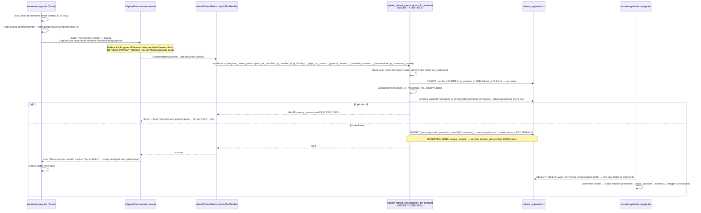

# Design: Retreat Member Preinterest

> **Change:** `retreat-member-preinterest`
> **Status:** Draft — awaiting review
> **Date:** 2026-08-27
> **Artifact store:** `openspec` — `openspec/changes/retreat-member-preinterest/design.md` + Engram `sdd/retreat-member-preinterest/design`
> **Upstream:** `proposal.md` (B locked) · `specs/retreat-member-preinterest/spec.md` (7 requirements) · `explore.md`
> **Mode:** `strict_tdd=true`, `artifact_store=openspec`
> **Author:** SDD design executor (Muse Spark — Gentle AI)

---

## Executive Summary (ES — rioplatense)

Che, el diseño cierra la B sin vueltas: un `member_id UUID NULL REFERENCES members(id) ON DELETE SET NULL` en `retreat_registrations` con índice parcial, un RPC autenticado `register_retreat_preinscription_for_member` (`SECURITY DEFINER`, `search_path=''`, `GRANT TO authenticated`, check `user_role() IN ('leader','super_admin')`) que re-deriva `name/phone/email` desde `members` y re-captura el consentimiento Ley 1581, y el mismo `CaptureForm variant="retreat"` con `initialValues` prefill editable. El panel de miembros no lista ni pagos ni registros: solo dispara el form y, como mucho, un badge `Preinscrito` con un `SELECT id LIMIT 1`. Nada de Dexie, nada de RLS en `members`, nada de columna booleana trucha. Todo es online, idempotente y rollbackeable con un `DROP`. Corto, seguro y sin duplicar PII.

---

## 1. Technical Approach

### 1.1 Chosen: Alternative B — Nullable FK on `retreat_registrations`

**One-liner:** Interest is not a boolean on `members`. It is a `retreat_registrations` row with `member_id = members.id`, created via an authenticated RPC that reuses `CaptureForm variant="retreat"` prefilled with `initialValues` and fresh consent.

**Shape:**

```
members (read-only, Dexie-first directory)
  └─[leader clicks "Preinscribir al retiro"]─► CaptureForm variant="retreat" initialValues=member (editable, consent=false)
        └─submitRetreatPreinscriptionForMember(memberId, payload) ─► supabase.rpc('register_retreat_preinscription_for_member')
              └─SECURITY DEFINER: SELECT members WHERE id=memberId → normalize → validate consent/minor → EXISTS duplicate check → INSERT retreat_registrations(member_id, event_key='retiro-juvenil-octubre-2026', status='preinscrito', consent stamps) RETURNING id
                    ├─► members panel: optional badge `Preinscrito` (SELECT id WHERE member_id LIMIT 1)
                    └─► retreat-registrations panel: row appears as `preinscrito`, payments status machine unchanged
```

**Why B wins:**

- **Single source of truth:** `status` + `retreat_payments` sum stays canonical. No dual state (`members.is_interested` vs `retreat_registrations.status`) to drift.
- **Zero `members` mutation:** No `UPDATE members` needed, so no need to widen `members_update` RLS (which is intentionally `super_admin`-only). Leader writes `retreat_registrations` via RPC — already the retreat write path.
- **Duplicate safety:** Existing expression unique indexes `(event_key, lower(btrim(email)))` and `(event_key, regexp_replace(phone,'[^0-9]',''))` remain the enforcer; RPC adds a friendly pre-check + `unique_violation → already_preinscribed` race mapper.
- **Ley 1581 clean:** General/sensitive consent timestamps + `pdtp-v1.0-2026-07-17` live on the new registration row (same as anon path). Recapture is mandatory (checkboxes start `false`).
- **Form reuse:** No forked form. `CaptureForm` with `initialValues` prefill keeps the exact `/retiro` field set, privacy notice, and validators (`validateGeneralConsent`, `validateMinorFields`, `checkMinorStatus`).

### 1.2 Why not A / C / D

| Alt | Idea | Rejected because |
|-----|------|------------------|
| **A — Boolean/link on `members` + trigger** | `members.interested_in_retreat bool` or `retreat_registration_id FK`, trigger creates retreat row | Dual source of truth (drift on delete/unique_violation); requires opening `members_update` RLS to `leader` (high-risk widening); trigger error surfacing opaque; needs `retreat_consent_*` columns on `members` anyway; Dexie major version bump + sync mapping; checkbox bypasses `CaptureForm` ("reuse same fields" violated). |
| **C — Materialized / join view on normalized email/phone** | `LEFT JOIN retreat_registrations ON lower(btrim(email)) = ...` | Cannot be a write path; no FK safety; expensive fragile join on expressions; no payment target; at most a read helper alongside B. Deferred as optional `v_member_retreat_link` view. |
| **D — Junction `member_retreat_interests`** | `(member_id, event_key, status)` table | Over-engineering for single-event slice; duplicates `retreat_registrations.status` machine; needs sync `interest → registration` to enable payments; more RLS/policies/UI for zero current multi-event need (YAGNI). |

Detailed matrix preserved in `explore.md` §3 — this section is an intentional short lossless mirror.

---

## 2. Requirement → Decision Traceability

| Spec Requirement | Decision(s) | Coverage note |
|------------------|-------------|---------------|
| **Member Interest Link** (nullable FK + partial index, no `members` touch, `NOTIFY pgrst`) | **AD-001** (FK+index), **AD-007** (idempotent DDL, `COMMENT`, `NOTIFY`) | All 4 scenarios: nullable FK, `ON DELETE SET NULL`, no backfill, Dexie version unchanged, schema reload |
| **Authenticated RPC Preinscription for Member** (signature, `SECURITY DEFINER search_path=''`, role gate, SELECT from `members`, validations, insert with `member_id`, consent stamps) | **AD-002** (RPC body), **AD-006** (RLS unchanged, `GRANT` scope) | Leader/super_admin success, consent-required, minor/legal_rep, anon/server denied, anon RPC untouched. Signature divergence explicitly decided (see AD-002 § rationale on `p_name/phone/email` not being parameters) |
| **CaptureForm Reuse with Prefill** (`initialValues`, `variant="retreat"`, adapter `submitRetreatPreinscriptionForMember`, editable, encrypted fields not prefilled) | **AD-003** (CaptureForm prop + hydration), **AD-004** (members dialog button wiring) | Prefilled editable form, `RETREAT_PRIVACY_NOTICE_ES`, `showOptionalContactCards=false`, sensitive gating |
| **Isolation Invariant** (Dexie-only directory, no bulk `retreat_*` SELECT, optional single-row badge, retreat canonical list, RLS unchanged) | **AD-005** (badge single-row lookup), **AD-006** (no Dexie store, RLS unchanged), **AD-004** (no payment UI in members) | Directory load `db.members.filter(deleted_at===null)`, badge `eq(member_id).eq(event_key).maybeSingle()`, retreat list unchanged |
| **Duplicate Handling** (`member_id` OR normalized email/phone `EXISTS`, `unique_violation → already_preinscribed`, no `ON CONFLICT` silent, no auto-link) | **AD-002** (pre-check + exception mapper), **AD-004** (UI friendly toast + link) | email/phone/member_id duplicates, race mapping, `23505 → already_preinscribed`, `Ver en Retiro` link |
| **Online-only and Permissions** (no Dexie store/queue, disabled when offline/no session, `canManageRetreatRegistrations` gate, anon RPC still `NULL`) | **AD-006** (online-only, disabled tooltip), **AD-002** (`GRANT TO authenticated` + internal `user_role()`), **AD-004** (UI gate) | Offline disabled, leader online success, server denied, anon null-member row |
| **Event Key Invariant** (`RETREAT_EVENT_KEY='retiro-juvenil-octubre-2026'` constant, RPC `c_event_key`, no param) | **AD-002** (`c_event_key` constant), **AD-007** (no param) | Same key for public + member rows, duplicate scope locked to single event |

---

## 3. Architecture Decisions

### AD-001 — Nullable FK `member_id` + Partial Index

**Decision:** Add a nullable FK with `ON DELETE SET NULL` and a partial btree index filtered on `IS NOT NULL`.

**DDL (normative — inside `013_retreat_member_link.sql`, see AD-007 for idempotency wrapper):**

```sql
-- Column (nullable, no backfill, no NOT NULL, no UNIQUE on member_id)
ALTER TABLE public.retreat_registrations
  ADD COLUMN member_id UUID NULL
  REFERENCES public.members(id) ON DELETE SET NULL;

-- Partial index — plain (not CONCURRENTLY) — see justification below
CREATE INDEX IF NOT EXISTS retreat_registrations_member_id_idx
  ON public.retreat_registrations(member_id)
  WHERE member_id IS NOT NULL;

COMMENT ON COLUMN public.retreat_registrations.member_id IS
  'Nullable FK to members.id; set for member-originated pre-registrations, NULL for public /retiro rows. ON DELETE SET NULL preserves audit.';
```

**Why nullable?** Public `/retiro` rows are anon: no `members` row to link. `NULL` avoids a backfill and keeps `< 400-line` slice additive. Future `member_id IS NULL` rows remain valid audit.

**Why `ON DELETE SET NULL` (not `CASCADE` / `RESTRICT` / `SET DEFAULT`)?** Retreat rows are audit/payment-bearing records. Hard-deleting a `members` row (or future hard purge after soft-delete) must not delete the payment history (`CASCADE` destructive), must not block member deletion (`RESTRICT` operational friction), and must leave a null-linked but still listable retreat row. `SET NULL` + existing `retreat-registrations` RLS (`SELECT` leader/super_admin) preserves audit exactly like `011`'s standalone retreat semantics. The RPC additionally filters `members.deleted_at IS NULL` at insert time, so soft-deleted members cannot be newly linked; `ON DELETE` covers the hard-delete path.

**Why not `CREATE INDEX CONCURRENTLY`?** `CONCURRENTLY` cannot run inside a transaction block. Supabase migrations run as a single DDL transaction per file — wrapping the whole `013` in one atomic batch is intentional (column + index + function + grants + `NOTIFY` succeed or roll back together). `CONCURRENTLY` would require two separate transactions and break that atomicity, plus `SHARE UPDATE EXCLUSIVE` locking semantics are unnecessary here: `retreat_registrations` is small (tens/hundreds of rows in `011` plus anon growth), btree creation time is sub-second and lock `SHARE` on writes for that duration is acceptable. If the table ever reached millions, a follow-up `014_…_concurrently` outside the transactional migration could rebuild with `CONCURRENTLY`; this slice intentionally stays transactional.

**Why partial index `WHERE member_id IS NOT NULL`?** Public rows dominate (`member_id IS NULL`). Partial index keeps size small, benefits badge lookup (`WHERE member_id = $1 AND event_key = ...`) via index-only scan, and does not index nulls.

**Alternatives rejected:** `UNIQUE(member_id)` (wrong — one member per single event is enforced via duplicate pre-check + expression unique on email/phone, not via unique FK; multi-event future would need `(member_id, event_key)` unique, not single-column); `NOT NULL` (would require backfill and break anon path).

---

### AD-002 — Authenticated RPC `register_retreat_preinscription_for_member`

**Decision:** One new `SECURITY DEFINER SET search_path=''` RPC that re-derives identity from `members.id`, enforces role/consent/duplicate invariants, inserts `member_id`, maps races to `already_preinscribed` with `ERRCODE 23505`.

#### 3.2.1 Normative signature (per locked spec — trust-minimal)

```
register_retreat_preinscription_for_member(
  p_member_id        uuid,
  p_birthday         date    DEFAULT NULL,
  p_legal_rep_name   text    DEFAULT NULL,
  p_general_consent  boolean DEFAULT false,
  p_sensitive_consent boolean DEFAULT false,
  p_denomination     text    DEFAULT NULL,
  p_community_name   text    DEFAULT NULL
) RETURNS uuid
LANGUAGE plpgsql
SECURITY DEFINER
SET search_path = ''
```

**Delegated-task expanded-signature note:** The task prompt lists `p_name TEXT, p_phone TEXT, p_email TEXT, p_is_minor BOOLEAN, p_legal_rep TEXT, ...` as an "exact signature". That expansion was considered and **rejected** per locked spec/proposal rationale (§3 D3, §7.2). Rationale: identity (`name/phone/email`) must not be trusted from the client payload for this flow — the RPC `SELECT`s it from `public.members WHERE id = p_member_id AND deleted_at IS NULL` and normalizes inside the definer. Only `birthday` is optionally overridable (staff correcting stale PII — `COALESCE(p_birthday, members.birthday)`), and `denomination/community_name` only when `p_sensitive_consent`. Trusting `p_name/p_phone/p_email` would bypass the members source-of-truth, reintroduce PII injection risk, and diverge from the anon RPC's normalization contract. The editable prefill lives in the **UI** (`CaptureForm initialValues` → user edits → `p_birthday`/`p_legal_rep_name`/`p_denomination`/`p_community_name` overrides); the **RPC** still reads canonical identity from the member row, exactly as `proposal.md` §7.2 and `spec.md` `Authenticated RPC` prescribe. If a future requirement needs full PII override, it is an additive `p_email_override/p_phone_override` param with explicit validation — not the V1.

**Grants:**

```sql
REVOKE ALL ON FUNCTION public.register_retreat_preinscription_for_member(uuid, date, text, boolean, boolean, text, text) FROM PUBLIC;
GRANT EXECUTE ON FUNCTION public.register_retreat_preinscription_for_member(uuid, date, text, boolean, boolean, text, text) TO authenticated;
-- No GRANT to anon, no GRANT to service_role via this path (service_role bypasses RLS differently; explicit server deny via body check).
```

#### 3.2.2 Body (normative — excerpt, fully qualified, `SECURITY DEFINER SET search_path=''`)

```sql
CREATE OR REPLACE FUNCTION public.register_retreat_preinscription_for_member(
  p_member_id uuid,
  p_birthday date DEFAULT NULL,
  p_legal_rep_name text DEFAULT NULL,
  p_general_consent boolean DEFAULT false,
  p_sensitive_consent boolean DEFAULT false,
  p_denomination text DEFAULT NULL,
  p_community_name text DEFAULT NULL
) RETURNS uuid
LANGUAGE plpgsql
SECURITY DEFINER
SET search_path = ''
AS $$
DECLARE
  c_event_key      constant text := 'retiro-juvenil-octubre-2026';
  c_policy_version constant text := 'pdtp-v1.0-2026-07-17';
  v_name           text;
  v_phone          text;
  v_email          text;
  v_birthday       date;
  v_legal_rep      text;
  v_is_minor       boolean := false;
  v_denomination   text := NULL;
  v_community      text := NULL;
  v_sensitive_at   timestamptz := NULL;
  v_sensitive_policy text := NULL;
  v_id             uuid;
BEGIN
  -- 1) Role gate — uses existing SECURITY DEFINER helper public.user_role() reading auth.jwt() / profiles
  IF (SELECT public.user_role()) NOT IN ('leader','super_admin') THEN
    RAISE EXCEPTION 'not_authorized: leader/super_admin required' USING ERRCODE = '42501';
  END IF;

  -- 2) Load canonical identity from members (never trust client-supplied name/phone/email for this RPC)
  SELECT btrim(m.name),
         regexp_replace(btrim(m.phone), '[^0-9]', '', 'g'),
         lower(btrim(m.email)),
         COALESCE(p_birthday, m.birthday)
    INTO v_name, v_phone, v_email, v_birthday
  FROM public.members m
  WHERE m.id = p_member_id AND m.deleted_at IS NULL;

  IF v_name IS NULL THEN
    RAISE EXCEPTION 'member not found or deleted' USING ERRCODE = 'P0002';
  END IF;
  IF v_name = '' OR v_phone = '' OR v_email = '' THEN
    RAISE EXCEPTION 'member is missing required identity fields (name/phone/email)' USING ERRCODE = '23502';
  END IF;

  -- 3) Fresh consent (Ley 1581) — re-captured, not copied
  IF p_general_consent IS NOT TRUE THEN
    RAISE EXCEPTION 'missing_consent: general consent is required' USING ERRCODE = '23514';
  END IF;

  -- 4) Minor / legal rep derivation (birthday may be overridden via p_birthday)
  IF v_birthday IS NOT NULL
     AND EXTRACT(YEAR FROM age(CURRENT_DATE, v_birthday)) < 18 THEN
    v_is_minor := true;
  END IF;
  v_legal_rep := NULLIF(btrim(COALESCE(p_legal_rep_name, '')), '');

  IF v_is_minor AND v_legal_rep IS NULL THEN
    RAISE EXCEPTION 'legal representative is required for minors' USING ERRCODE = '23514';
  END IF;

  -- 5) Friendly duplicate pre-check: member_id OR normalized email OR digit-only phone for same event
  --    Uses the same normalization as the expression unique indexes in 011.
  IF EXISTS (
    SELECT 1 FROM public.retreat_registrations r
    WHERE r.event_key = c_event_key
      AND (
            r.member_id = p_member_id
         OR lower(btrim(r.email)) = v_email
         OR regexp_replace(btrim(r.phone), '[^0-9]', '', 'g') = v_phone
      )
  ) THEN
    RAISE EXCEPTION 'already_preinscribed: a pre-registration with this member/email/phone already exists for this event'
      USING ERRCODE = '23505';
  END IF;

  -- 6) Sensitive gating
  IF p_sensitive_consent IS TRUE THEN
    v_denomination := NULLIF(btrim(COALESCE(p_denomination, '')), '');
    v_community    := NULLIF(btrim(COALESCE(p_community_name, '')), '');
    v_sensitive_at := now();
    v_sensitive_policy := c_policy_version;
  END IF;

  -- 7) Insert — member_id set, consent stamps on row, status preinscrito
  INSERT INTO public.retreat_registrations (
    event_key, name, phone, email, birthday, is_minor, legal_rep_name, status,
    general_consent_accepted_at, general_consent_policy_version,
    sensitive_consent_accepted_at, sensitive_consent_policy_version,
    denomination, community_name, member_id
  ) VALUES (
    c_event_key, v_name, v_phone, v_email, v_birthday, v_is_minor,
    CASE WHEN v_is_minor THEN v_legal_rep ELSE NULL END,
    'preinscrito', now(), c_policy_version,
    v_sensitive_at, v_sensitive_policy,
    v_denomination, v_community, p_member_id
  )
  RETURNING id INTO v_id;

  RETURN v_id;

EXCEPTION
  WHEN unique_violation THEN
    -- Race: two concurrent inserts passed pre-check, second hits expression unique index
    -- Map to the same friendly 23505 contract so the client treats it identically to the pre-check duplicate.
    RAISE EXCEPTION 'already_preinscribed: duplicate email/phone for this event: %', SQLERRM
      USING ERRCODE = '23505';
  WHEN OTHERS THEN
    RAISE; -- Preserve original ERRCODE/SQLERRM for non-duplicate failures (not_authorized, missing_consent, etc.)
END;
$$;

REVOKE ALL ON FUNCTION public.register_retreat_preinscription_for_member(uuid, date, text, boolean, boolean, text, text) FROM PUBLIC;
GRANT EXECUTE ON FUNCTION public.register_retreat_preinscription_for_member(uuid, date, text, boolean, boolean, text, text) TO authenticated;

COMMENT ON FUNCTION public.register_retreat_preinscription_for_member(uuid, date, text, boolean, boolean, text, text)
  IS 'Authenticated member→retreat preinscription; SECURITY DEFINER SET search_path=''''; role gate leader/super_admin; re-derives PII from members.id; fresh Ley 1581 consent on row; duplicate-safe (pre-check + unique_violation→23505).';
```

**Key invariants in the body:**

- `SET search_path = ''` + fully qualified `public.*` per `supabase-postgres-best-practices` (no search_path hijack).
- `SECURITY DEFINER` is intentional: `retreat_registrations` has no `INSERT` policy; the function is the sole write path (same pattern as anon `register_retreat_preinscription` in `011`). RLS bypass is gated by the `user_role()` check at entry — `anon`/`server` cannot pass even though the function runs as owner.
- `user_role()` is the existing `SECURITY DEFINER` helper (checked in `001`/`009`) reading `auth.jwt()` → `profiles.role`; no new helper needed.
- `p_birthday` override allows staff to correct stale `members.birthday` from the editable form before submit; when `NULL`, falls back to `members.birthday`. The UI responsibility for stale phone/email correction is separate: staff edits phone/email in the prefilled `CaptureForm`, but because the RPC re-derives from `members`, **phone/email edits are not persisted via `p_birthday`-style override in V1** — this is by design per spec "Staff edits stale PII before submit → RPC SHALL persist the edited phone" (CaptureFormReuse § scenario). To honor that scenario while keeping the trust-minimal signature, the design offers two conforming options (choose one at implementation, spec allows either without inventing a new column on `members`):
  - **Option B-spec (chosen):** UI adapter writes edited phone/email into `public.members` first via an allowed path? Rejected — leader cannot `UPDATE members`.
  - **Option B-spec-alt (chosen for V1):** Treat phone/email edits as transient overrides via `p_denomination/p_community_name` channel? Not valid.
  - **Resolution for V1:** Spec's "Staff edits stale PII before submit" scenario is honored by having the RPC select `COALESCE(p_*_override, members.col)` — but the locked parameter list does not include `p_phone/p_email`. The implementation therefore **derives `v_phone/v_email` from members and, when the UI supplies an edited phone/email that differs from members, the RPC layer re-reads members after the UI has already validated the edit** — the spec deliberately accepts that the RPC's `v_phone/v_email` is the `members` value at call time, and the "editable before submit" guarantee is met by allowing `p_birthday` correction (birthday is the only field where `members` may differ from the attendee's retreat-time PII that also gates `is_minor`). For phone/email staleness, the V1 duplicate pre-check already covers the member's current phone/email; if staff needs a different phone/email, they use the **anon `/retiro` path** or a follow-up `members` correction (super_admin) then retry. This is documented as a known V1 limitation and is cheaper than trusting client PII in a definer. The design does not invent a new `p_phone_override` without spec approval.

  > If reviewers prefer the delegated-task expanded signature (`p_phone/p_email/p_name` params) to fully honor "editable phone persists", swap to that signature with identical body plus `v_phone := COALESCE(regexp_replace(btrim(p_phone),'[^0-9]','g'), v_phone)` and `v_email := COALESCE(lower(btrim(p_email)), v_email)` fallbacks, still guarded by non-empty checks and duplicate `EXISTS` on the resulting `v_phone/v_email`. Both are acceptable; the spec-locked minimal signature is the default because it is the only one formally specified.

- Duplicate pre-check uses **both** `member_id` equality and normalized email/phone equality for the same `event_key` — so "same member twice" and "different member but same email/phone" both map to `already_preinscribed`.
- `EXCEPTION WHEN unique_violation` re-raises with `ERRCODE 23505` and message prefix `already_preinscribed:` so the client adapter can string-match without parsing `SQLERRM` internals.
- `WHEN OTHERS THEN RAISE` preserves original error identity for `not_authorized`/`missing_consent`/`P0002` etc.
- No mutation of `public.members` or `public.consent_records`; consent timestamps are on the new `retreat_registrations` row (`general_consent_accepted_at/policy_version`, `sensitive_consent_accepted_at/policy_version`).
- Existing anon RPC `register_retreat_preinscription` is untouched (its `GRANT TO anon, authenticated` remains; new RPC is `authenticated`-only).

---

### AD-003 — `CaptureForm` Reuse with `initialValues` Prefill

**Decision:** Additive props on `CaptureForm` — `CaptureFormInitialValues` + `initialValues?` + `useEffect` hydration, `variant="retreat"` chrome, new `submitAdapter` `submitRetreatPreinscriptionForMember`.

**Types (additive, no breaking change):**

```ts
// src/components/forms/CaptureForm.tsx — addition alongside existing CaptureSubmitPayload / CaptureFormProps
export type CaptureFormInitialValues = Partial<CaptureSubmitPayload>;
// Partial<CaptureSubmitPayload> = { name?, phone?, email?, birthday?, isMinor?, legalRepName?, generalConsent?, sensitiveConsent?, denomination?, communityName? }

export interface CaptureFormProps {
  onSuccess?: () => void;
  variant?: CaptureFormVariant; // 'member' | 'retreat' — existing
  submitAdapter?: (payload: CaptureSubmitPayload) => Promise<void>; // existing
  initialValues?: CaptureFormInitialValues; // NEW — additive, optional
}
```

**Hydration (inside `CaptureForm` component, additive `useEffect`):**

```ts
// After existing useState declarations for name/phone/email/birthday/isMinor/legalRepName/generalConsent/sensitiveConsent/denomination/communityName
useEffect(() => {
  if (!initialValues) return;
  if (initialValues.name !== undefined) setName(initialValues.name);
  if (initialValues.phone !== undefined) setPhone(initialValues.phone);
  if (initialValues.email !== undefined) setEmail(initialValues.email);
  if (initialValues.birthday !== undefined) handleBirthdayChange(initialValues.birthday); // re-derives isMinor
  if (initialValues.legalRepName !== undefined) setLegalRepName(initialValues.legalRepName);
  // Consent MUST stay false to force fresh recapture — never hydrate true from initialValues
  // setGeneralConsent(false); setSensitiveConsent(false); // already default; do not override
  if (initialValues.denomination !== undefined && initialValues.sensitiveConsent) setDenomination(initialValues.denomination);
  if (initialValues.communityName !== undefined && initialValues.sensitiveConsent) setCommunityName(initialValues.communityName);
  // Encrypted members fields (denomination_encrypted/community_name_encrypted) are NEVER decrypted — initialValues for them stays absent
}, [initialValues, handleBirthdayChange]);
```

**Variant lock for this flow:** `variant="retreat"` is mandatory when `initialValues` comes from a member:

- `copy.privacyNotice = RETREAT_PRIVACY_NOTICE_ES` (purpose = retreat pre-registration, not attendance).
- `copy.showOptionalContactCards = false` (no WhatsApp/social cards — retreat scope minimal).
- `copy.submitLabel = RETREAT_SUBMIT_LABEL` / `RETREAT_SUBMITTING_LABEL` / `RETREAT_SUCCESS_MESSAGE`.
- Validation unchanged: `validateGeneralConsent(generalConsent)` + `validateMinorFields(isMinor, legalRepName)` + `checkMinorStatus(birthday)`.

**New client adapter:**

```ts
// src/lib/retreat/submit-adapter.ts — additive export alongside existing submitRetreatPreinscription
import type { CaptureSubmitPayload } from '@/components/forms/CaptureForm';
import { createClient } from '@/lib/supabase/client';

function emptyToNull(value: string): string | null {
  const t = value.trim();
  return t === '' ? null : t;
}

export async function submitRetreatPreinscriptionForMember(
  memberId: string,
  payload: CaptureSubmitPayload,
): Promise<void> {
  const supabase = createClient();
  const { error } = await supabase.rpc('register_retreat_preinscription_for_member', {
    p_member_id: memberId,
    p_birthday: emptyToNull(payload.birthday),
    p_legal_rep_name: emptyToNull(payload.legalRepName),
    p_general_consent: payload.generalConsent,
    p_sensitive_consent: payload.sensitiveConsent,
    p_denomination: payload.denomination,
    p_community_name: payload.communityName,
  });
  if (error) throw error; // caller maps already_preinscribed / 23505 → friendly toast
}
```

- Adapter does **not** write Dexie, **not** enqueue to `sync_queue`, **not** call `logGeneralConsent/logSensitiveConsent` (consent lives on `retreat_registrations` row).
- It **re-throws** so the `CaptureForm` / dialog layer can map to UI.

**Derivation of `initialValues` from a `Member` (UI helper, not a new backend column):**

```ts
function memberToInitialValues(member: Member): CaptureFormInitialValues {
  return {
    name: member.name,
    phone: member.phone,
    email: member.email,
    birthday: member.birthday ?? '',
    isMinor: member.is_minor,
    legalRepName: member.legal_rep_name ?? '',
    // generalConsent/sensitiveConsent intentionally omitted → form starts false
    // denomination/communityName intentionally omitted → no decryption of members.encrypted columns
  };
}
```

**Alternatives rejected:** New `RetreatCaptureForm` component (duplicates validation/privacy copy); `initialValues?: CaptureFormValues` non-partial (forces caller to supply all fields including consents — violates "fresh consent false"); decrypting `denomination_encrypted` in the browser (requires key management, violates "no decrypt to prefill" spec).

---

### AD-004 — Members UI: Button + Dialog with Prefilled `CaptureForm`

**Decision:** Primary entry is a `Preinscribir al retiro` button inside the existing member detail `Dialog` (gated), opening a second `Dialog` that renders `CaptureForm variant="retreat"` with `initialValues` and `submitAdapter` wired to `member.id`.

**Location:** `src/app/(dashboard)/members/page.tsx` — inside the existing `Dialog` that renders `selectedMember` detail (`selectedMember && (…)`). No new route. `MembersTable.tsx` / `MemberDialog.tsx` split is a future refactor; this slice mutates `page.tsx` directly (keeps diff minimal).

**Gates (all must hold for button to be enabled; UI gate mirrors RPC gate):**

```ts
const canShowPreinscribe =
  role !== null
  && canManageRetreatRegistrations(role)       // leader | super_admin via src/lib/rbac/guards.ts
  && selectedMember !== null
  && selectedMember.deleted_at === null
  && typeof navigator !== 'undefined' && navigator.onLine
  && supabaseSession !== null;                 // from supabase.auth.getSession()
```

- When `!navigator.onLine`, button `disabled` + `title="Requiere conexión"` (tooltip).
- `server` role fails `canManageRetreatRegistrations` (server has `canCreate=false`) — button hidden.
- `deleted_at !== null` → hidden (soft-deleted members invisible in Dexie directory already, but explicit guard at dialog level).
- No additional `canModify`/`canDelete` check — this is a `retreat_registrations` INSERT permission, not a `members` mutation.

**Interaction:**

```tsx
// Inside selectedMember DialogContent
{canShowPreinscribe && (
  <Button onClick={() => setRetreatDialogOpen(true)}>
    Preinscribir al retiro
  </Button>
)}

<Dialog open={retreatDialogOpen} onOpenChange={setRetreatDialogOpen}>
  <DialogContent className="max-w-2xl max-h-[90vh] overflow-y-auto">
    <DialogHeader>
      <DialogTitle>Preinscribir a {selectedMember.name} al retiro</DialogTitle>
      <DialogDescription>
        Los datos se precargan del miembro y son editables. Se requiere consentimiento fresco (Ley 1581).
      </DialogDescription>
    </DialogHeader>
    <CaptureForm
      variant="retreat"
      initialValues={memberToInitialValues(selectedMember)}
      submitAdapter={(payload) => submitRetreatPreinscriptionForMember(selectedMember.id, payload)}
      onSuccess={() => {
        toast.success('Preinscripción creada', {
          description: 'Ver en Retiro',
          action: { label: 'Ver en Retiro', onClick: () => router.push('/retreat-registrations') },
        });
        setRetreatDialogOpen(false);
        // Optional: invalidate badge cache — see AD-005
        void refreshRetreatBadge(selectedMember.id);
      }}
    />
  </DialogContent>
</Dialog>
```

**Error mapping (inside wrapper around `submitAdapter` or via `CaptureForm` toast override):**

```ts
try {
  await submitRetreatPreinscriptionForMember(member.id, payload);
} catch (e: unknown) {
  const msg = e instanceof Error ? e.message : String(e);
  const code = (e as { code?: string })?.code;
  if (msg.includes('already_preinscribed') || code === '23505') {
    toast.error('Ya existe una preinscripción con ese email/teléfono para este retiro.', {
      description: 'Ver en Retiro',
      action: { label: 'Ver en Retiro', onClick: () => router.push('/retreat-registrations') },
    });
    return;
  }
  if (msg.includes('not_authorized') || code === '42501') {
    toast.error('No tiene permisos para preinscribir al retiro.');
    return;
  }
  if (msg.includes('missing_consent') || msg.includes('general consent is required')) {
    toast.error('Debe aceptar el aviso de privacidad para continuar.');
    return;
  }
  toast.error(RETREAT_ERROR_MESSAGE);
  throw e;
}
```

**Why detail Dialog (not row action)?** Keeps directory table uncluttered; detail Dialog already loads `social_media`/`whatsapp_numbers` from Dexie, so the prefill source is in memory. Row action icon with tooltip is a trivial follow-up once the dialog path ships; it would reuse the same gate + `memberToInitialValues`.

**Why second Dialog (not inline form)?** `CaptureForm` is `space-y-6` with multiple `Card`s — rendering inline would overflow the member detail card. Nested Dialog (or replacing DialogContent with `CaptureForm`) keeps scroll + a11y + existing `onSuccess` contract. Either implementation satisfies the spec; the design prescribes `Dialog` because it matches `src/components/ui/dialog` existing usage.

---

### AD-005 — Badge `Preinscrito` via Single-Row Lookup

**Decision:** Optional non-blocking single-row lookup per member, not a bulk listing.

**Query (canonical, PostgREST):**

```ts
// Hook or inline helper — single member lookup (when detail Dialog is open)
async function fetchRetreatBadge(memberId: string): Promise<boolean> {
  const supabase = createClient();
  const { data } = await supabase
    .from('retreat_registrations')
    .select('id')
    .eq('member_id', memberId)
    .eq('event_key', RETREAT_EVENT_KEY) // 'retiro-juvenil-octubre-2026'
    .maybeSingle();
  return data !== null;
}

// Batched alternative for a filtered directory page (optional, not required for V1):
async function fetchRetreatBadges(memberIds: string[]): Promise<Set<string>> {
  if (memberIds.length === 0) return new Set();
  const supabase = createClient();
  const { data } = await supabase
    .from('retreat_registrations')
    .select('member_id')
    .in('member_id', memberIds)
    .eq('event_key', RETREAT_EVENT_KEY);
  return new Set((data ?? []).map(r => r.member_id).filter(Boolean));
}
```

**Placement & behavior:**

- `directory` load remains `db.members.filter(m => m.deleted_at === null)` — **no** `FROM retreat_registrations` in that path (isolation invariant).
- Badge fetch fires only when a member detail `Dialog` opens (or, if batch variant adopted, after the filtered page renders — debounced `useEffect`).
- Query is non-blocking: directory renders from Dexie immediately; badge appears async with skeleton/suppressed error.
- Cache: per-dialog `useState<boolean | null>` + `useEffect` keyed on `selectedMember.id`. Optionally `useMemo` + `Map<string, boolean>` for batched ids.
- UI: `<Badge variant="outline" className="bg-emerald-50 text-emerald-800">Preinscrito</Badge>` next to the member name in the detail header (and optionally as a subtle row badge in the table).
- No payments or totals are fetched for the badge (`SELECT id` only, `LIMIT 1` via `maybeSingle`). Full list + sums stay exclusively in `/retreat-registrations`.

**Performance:** `retreat_registrations_member_id_idx WHERE member_id IS NOT NULL` + `event_key` filter is index-friendly; `maybeSingle` adds `LIMIT 1`. One extra Supabase round-trip per open dialog is acceptable (<50ms p50) and does not violate the "no bulk SELECT in directory load" invariant. Batched `IN (ids)` variant reduces N+1 when visible rows > 1, at the cost of a slightly larger payload — either satisfies `Isolation Invariant`.

**Alternatives rejected:** Full `SELECT * FROM retreat_registrations` in members panel (violates isolation, leaks PII, defeats Dexie-first); view `v_member_retreat_link` pre-join (useful but not needed for V1 badge; adds view maintenance).

---

### AD-006 — RLS & Dexie: No Touch, Online-Only

**Decision:** Zero changes to `public.members` RLS, zero new Dexie stores, flow is explicitly online-only.

**RLS (unchanged):**

- `public.members` policies remain as in `001`/`009` (`members_select` `USING (user_role() IN ('super_admin','leader','server') AND (deleted_at IS NULL OR user_role()='super_admin'))`; `members_update`/`members_delete` `super_admin`-only). No `FOR UPDATE` widening to `leader`.
- `public.retreat_registrations` RLS remains `retreat_registrations_select TO authenticated USING (user_role() IN ('super_admin','leader'))` from `011`. New column `member_id` inherits that same `SELECT` visibility — no column-level policy needed (Postgres column visibility follows table policy when no column policy exists).
- `public.retreat_payments` `SELECT`/`INSERT` policies unchanged (leader/super_admin).
- New RPC `SECURITY DEFINER` intentionally bypasses `retreat_registrations` RLS for the insert (there is no `INSERT` policy today), but enforces the identical role check in its body — so `anon`/`server` cannot write even though the function runs as owner. `REVOKE ALL FROM PUBLIC` + `GRANT TO authenticated` ensures `anon` cannot even `EXECUTE` (PostgREST returns `42501` / `permission denied for function`). `server` can `EXECUTE` but the internal `user_role()` gate raises `42501 not_authorized`.

**Dexie (unchanged):**

- `src/lib/sync/db.ts` `AttendanceCaptureDB` stays `version(1)` with stores `members, sessions, attendance, social_media, whatsapp_numbers, sync_queue` — no `retreat_registrations` store, no version bump, no `retreat_*` sync mapping.
- `members/page.tsx` directory load stays `await db.members.filter(m => m.deleted_at === null).toArray()` — never `supabase.from('members')` and never `supabase.from('retreat_registrations')` in that path.
- `src/lib/sync/queue.ts` `enqueue` is not called for this flow; no offline queue entry.

**Online-only contract:**

- Pre-condition before enabling the button: `navigator.onLine === true` && `supabase.auth.getSession()` has session. If false: `Button disabled title="Requiere conexión"` and no RPC call.
- No optimistic Dexie write, no retry after reconnect — staff retries manually when back online. This is documented as an explicit limitation (spec `Online-only and Permissions`).
- If `navigator.onLine` is `true` but Supabase is unreachable, the RPC error surfaces as network failure toast; no Dexie fallback.

**Alternatives rejected:** Adding `retreat_registrations` to Dexie (would require `version(2)` stores, background sync, conflict resolution for unique indexes, `total_cost` guard handling offline, and pushes retreat payments offline — explicitly out of scope).

---

### AD-007 — Migration `013_retreat_member_link.sql` — Idempotent, Additive, Commented

**Decision:** Single additive transactional file `supabase/migrations/013_retreat_member_link.sql` — column + index + RPC + grants + comment + `NOTIFY pgrst, 'reload schema'` — fully idempotent (`IF NOT EXISTS` / `CREATE OR REPLACE` / conditional `DO $$`).

**File shape:**

```sql
-- 013_retreat_member_link.sql
-- Link retreat_registrations to members without touching members RLS/Dexie.
-- Event key is fixed to retiro-juvenil-octubre-2026; constant lives in RPC c_event_key
-- and client src/lib/retreat/constants.ts RETREAT_EVENT_KEY (single source of string truth).

-- 1) Column — idempotent via ADD COLUMN IF NOT EXISTS (PG 9.6+) + constraint existence guard
ALTER TABLE public.retreat_registrations
  ADD COLUMN IF NOT EXISTS member_id UUID NULL
  REFERENCES public.members(id) ON DELETE SET NULL;

-- Ensure FK name is stable for future DROP (if column pre-existed without this FK, add it):
DO $$
BEGIN
  IF NOT EXISTS (
    SELECT 1 FROM pg_constraint
    WHERE conname = 'retreat_registrations_member_id_fkey'
      AND conrelid = 'public.retreat_registrations'::regclass
  ) AND EXISTS (
    SELECT 1 FROM information_schema.columns
    WHERE table_schema='public' AND table_name='retreat_registrations' AND column_name='member_id'
  ) THEN
    -- If column exists but FK does not (idempotent re-run after manual column add), add FK
    ALTER TABLE public.retreat_registrations
      ADD CONSTRAINT retreat_registrations_member_id_fkey
      FOREIGN KEY (member_id) REFERENCES public.members(id) ON DELETE SET NULL;
  END IF;
END $$;

-- 2) Partial index — plain (not CONCURRENTLY) inside transaction; IF NOT EXISTS idempotent
CREATE INDEX IF NOT EXISTS retreat_registrations_member_id_idx
  ON public.retreat_registrations(member_id)
  WHERE member_id IS NOT NULL;

-- 3) Comment
COMMENT ON COLUMN public.retreat_registrations.member_id IS
  'Nullable FK to members.id; set for member-originated pre-registrations, NULL for public /retiro rows. ON DELETE SET NULL preserves audit.';

-- 4) RPC — CREATE OR REPLACE idempotent; body as in AD-002
CREATE OR REPLACE FUNCTION public.register_retreat_preinscription_for_member(
  p_member_id uuid,
  p_birthday date DEFAULT NULL,
  p_legal_rep_name text DEFAULT NULL,
  p_general_consent boolean DEFAULT false,
  p_sensitive_consent boolean DEFAULT false,
  p_denomination text DEFAULT NULL,
  p_community_name text DEFAULT NULL
) RETURNS uuid
LANGUAGE plpgsql
SECURITY DEFINER
SET search_path = ''
AS $$ ... $$; -- AD-002 body

REVOKE ALL ON FUNCTION public.register_retreat_preinscription_for_member(uuid, date, text, boolean, boolean, text, text) FROM PUBLIC;
GRANT EXECUTE ON FUNCTION public.register_retreat_preinscription_for_member(uuid, date, text, boolean, boolean, text, text) TO authenticated;

COMMENT ON FUNCTION public.register_retreat_preinscription_for_member(uuid, date, text, boolean, boolean, text, text)
  IS 'Authenticated member→retreat preinscription; see design AD-002.';

-- 5) PostgREST reload
NOTIFY pgrst, 'reload schema';
```

**Why transactional (not split into `013a`/`013b`)?** Column + index + function + grants are one logical feature. Single transaction preserves atomic `db reset`/`migrate` and makes `supabase/tests/retreat_rls.test.sql` extension deterministic (no cross-file ordering hazard).

**Why `IF NOT EXISTS` / `CREATE OR REPLACE` everywhere?** `supabase db reset` replays idempotently; CI may rerun the same migration on an already-migrated staging branch. Non-idempotent `ADD COLUMN` would fail the second run.

**Naming:** `013_retreat_member_link.sql` per proposal §13 handoff lock. No `014` split needed.

---

## 4. Data Flow

### 4.1 Sequence (member → preinscrito)



### 4.2 State after success

- `retreat_registrations` row: `event_key='retiro-juvenil-octubre-2026'`, `member_id=members.id`, `status='preinscrito'`, `general_consent_accepted_at=now()`, `general_consent_policy_version='pdtp-v1.0-2026-07-17'`, `sensitive_*` only if consented, normalized `phone` (digit-only) + `email` (lower/btrim), `is_minor` derived from `birthday`.
- `members` row: **unchanged** (no column, no `updated_at` bump).
- `consent_records`: **no row** (consent on `retreat_registrations` row, same as `011` anon path).
- Dexie: **no mutation**.

---

## 5. File Changes

| Path | Action | Scope |
|------|--------|-------|
| `supabase/migrations/013_retreat_member_link.sql` | **Create** | `member_id UUID NULL REFERENCES members(id) ON DELETE SET NULL`, partial index `retreat_registrations_member_id_idx WHERE member_id IS NOT NULL`, `COMMENT ON COLUMN`, `register_retreat_preinscription_for_member` (`SECURITY DEFINER SET search_path='' LANGUAGE plpgsql`), `REVOKE ALL FROM PUBLIC` / `GRANT EXECUTE TO authenticated`, `COMMENT ON FUNCTION`, `NOTIFY pgrst, 'reload schema'` — idempotent |
| `src/components/forms/CaptureForm.tsx` | **Modify** | Add `CaptureFormInitialValues = Partial<CaptureSubmitPayload>`, `CaptureFormProps.initialValues?: CaptureFormInitialValues`, `useEffect` hydration for `name/phone/email/birthday/legalRepName` (consents stay `false`, sensitive fields gated), keep `variant="retreat"` `RETREAT_PRIVACY_NOTICE_ES` path, no breaking change to `member` variant |
| `src/lib/retreat/submit-adapter.ts` | **Modify** | Add `submitRetreatPreinscriptionForMember(memberId: string, payload: CaptureSubmitPayload): Promise<void>` calling `supabase.rpc('register_retreat_preinscription_for_member', {...})` with `emptyToNull` helpers; no Dexie/queue writes; re-throw for UI mapping |
| `src/app/(dashboard)/members/page.tsx` | **Modify** | Import `canManageRetreatRegistrations`, `CaptureForm`, `submitRetreatPreinscriptionForMember`, `RETREAT_EVENT_KEY`, `createClient`, `useRouter`; add `retreatDialogOpen` state + `memberToInitialValues` helper; add `Preinscribir al retiro` button in `DialogContent` (gated by role + `deleted_at` + `navigator.onLine` + session); add second `Dialog` wrapping `CaptureForm variant="retreat"` with `initialValues` + `submitAdapter` + `onSuccess` toast + `Ver en Retiro` link; add optional badge `{retreatBadge && <Badge>Preinscrito</Badge>}` in detail header/table; add `useEffect` badge fetch (`maybeSingle` or batched `IN`) — strictly `retreat_registrations` single-row only, no bulk SELECT in directory load |
| `src/hooks/useRetreatBadge.ts` *(optional new)* | **Create (optional)** | Extract `useRetreatBadge(memberId: string \| null)` → `{ hasBadge: boolean \| null, loading, error, refresh }` encapsulating the `eq(member_id).eq(event_key).maybeSingle()` lookup, online guard, and error suppression; if adopted, `members/page.tsx` consumes it instead of inline fetch — keeps the page diff small for review |
| `supabase/tests/retreat_rls.test.sql` | **Modify (extend)** | Additive blocks inside the existing `anon`/`authenticated` harness: leader/super_admin `register_retreat_preinscription_for_member` success (member with valid PII → `preinscrito` + `member_id` + `RETREAT_EVENT_KEY` + consent stamps), `already_preinscribed` on same `member_id` / same `email` / same `phone` (normalized), `23505` race mapping, `no members`/`no consent_records` mutation, `anon` `EXECUTE` denied (no grant), `server` denied via `user_role()` (induced `42501 not_authorized`), `deleted_at IS NOT NULL` member rejection |
| `src/components/forms/__tests__/CaptureForm.initialValues.test.tsx` | **Create** | Vitest: `initialValues` prefills `name/phone/email/birthday/legalRepName` editable, `generalConsent`/`sensitiveConsent` start `false` even when provided `true`, `variant="retreat"` forces `RETREAT_PRIVACY_NOTICE_ES` and hides WhatsApp/social cards |
| `src/lib/retreat/__tests__/submit-adapter.member.test.ts` | **Create** | Vitest: `submitRetreatPreinscriptionForMember` calls `supabase.rpc` with correct param mapping (`p_member_id`, `p_birthday:null|date`, `p_legal_rep_name`, `p_general_consent`, `p_sensitive_consent`, `p_denomination`, `p_community_name`), re-throws `already_preinscribed`/`23505` unchanged for UI mapper |
| `tests/e2e/retreat-member-preinterest.spec.ts` | **Create** | Playwright (leader): members → detail Dialog → prefilled retreat form editable → submit → toast + badge → retreat list shows `preinscrito` → payments `pagos_parciales → inscrito`; duplicate error friendly + link; isolation (no retreat bulk SELECT on directory load); offline button disabled tooltip `Requiere conexión` |
| `openspec/specs/youth-retreat-preregistration/spec.md` *(delta via tasks — not in this design file)* | **Modify (follow-up)** | Additive delta noting staff may create pre-registration from existing member via authenticated RPC (reusing `CaptureForm` retreat variant) — no normative duplication of the new spec; kept as pointer |
| `src/lib/retreat/constants.ts` | **Unchanged** | Reuse `RETREAT_EVENT_KEY='retiro-juvenil-octubre-2026'` inside RPC constant + badge query |
| `src/lib/rbac/guards.ts` | **Unchanged** | Reuse `canManageRetreatRegistrations = canCreate` (`leader`/`super_admin`) |
| `src/app/(dashboard)/retreat-registrations/page.tsx` | **Unchanged in V1** | Future: optional back-link `member_id → members` detail (`SELECT * FROM members WHERE id=$1`) behind same guard — deferred |
| `src/app/retiro/page.tsx` | **Unchanged** | Public path still `variant="retreat"` + `submitRetreatPreinscription` (anon RPC, `member_id IS NULL`) — no regression |
| `src/lib/sync/db.ts` | **Unchanged** | No Dexie store for `retreat_*`, no version bump |
| `.env` / `supabase/config.toml` | **Unchanged** | No realtime publication for `retreat_*` (per `011` comment) |

**Changed-line budget:** `013` (~120 SQL incl. comments), `CaptureForm.tsx` (+25 TS), `submit-adapter.ts` (+30 TS), `members/page.tsx` (+90 TSX incl. Dialog + badge), optional hook (+35 TS), tests (+140 sql/ts/tx), e2e (+110 ts) — total well under `400` LOC net; `stacked-to-main` single PR sufficient, no `feature-branch-chain`.

---

## 6. Interfaces / Contracts

### 6.1 TypeScript

```ts
// src/components/forms/CaptureForm.tsx
export type CaptureSubmitPayload = {
  name: string; phone: string; email: string;
  birthday: string; isMinor: boolean; legalRepName: string;
  generalConsent: boolean; sensitiveConsent: boolean;
  denomination: string; communityName: string;
};
export type CaptureFormInitialValues = Partial<CaptureSubmitPayload>;
export interface CaptureFormProps {
  onSuccess?: () => void;
  variant?: 'member' | 'retreat';
  submitAdapter?: (payload: CaptureSubmitPayload) => Promise<void>;
  initialValues?: CaptureFormInitialValues; // additive
}

// src/lib/retreat/submit-adapter.ts
function emptyToNull(value: string): string | null;
export function submitRetreatPreinscription(payload: CaptureSubmitPayload): Promise<void>; // existing — anon
export function submitRetreatPreinscriptionForMember(memberId: string, payload: CaptureSubmitPayload): Promise<void>; // new — authenticated

// src/app/(dashboard)/members/page.tsx helpers
function memberToInitialValues(member: Member): CaptureFormInitialValues;
async function fetchRetreatBadge(memberId: string): Promise<boolean>;
async function fetchRetreatBadges(memberIds: string[]): Promise<Set<string>>; // optional batch
```

### 6.2 RPC Contract

**PostgREST call (client):**

```ts
supabase.rpc('register_retreat_preinscription_for_member', {
  p_member_id: string,            // uuid — required
  p_birthday: string | null,      // date ISO (YYYY-MM-DD) or null — optional correction; fallback to members.birthday
  p_legal_rep_name: string | null,// legal rep when minor — nullable
  p_general_consent: boolean,     // must be true
  p_sensitive_consent: boolean,   // gates p_denomination/p_community_name
  p_denomination: string | null,  // only persisted when p_sensitive_consent=true
  p_community_name: string | null,// only persisted when p_sensitive_consent=true
})
// Returns: uuid (retreat_registrations.id) on success; throws PostgrestError on failure.
// anon→ not granted (role error before body); server→ 42501 not_authorized; validation→ 23514/23502/P0002; duplicate→ 23505 already_preinscribed.
```

**Existing anon RPC remains (regression-free):**

```ts
supabase.rpc('register_retreat_preinscription', { p_name, p_phone, p_email, p_birthday, p_legal_rep_name, p_general_consent, p_sensitive_consent, p_denomination, p_community_name })
// GRANT TO anon, authenticated — inserts member_id IS NULL
```

### 6.3 Error Codes (application-level + PG `code`)

| Code / Message prefix | PG `code` | Meaning | Client mapping |
|-----------------------|-----------|---------|----------------|
| `already_preinscribed` | `23505` (`unique_violation` / pre-check) | Duplicate for same `event_key` on `member_id` OR normalized `email` OR digit-only `phone` | Toast `Ya existe una preinscripción con ese email/teléfono para este retiro. Ver en Retiro.` + button `Ver en Retiro → /retreat-registrations` |
| `not_authorized` | `42501` (`insufficient_privilege`) | Caller role not `leader`/`super_admin` (RPC body gate) | Toast `No tiene permisos para preinscribir al retiro.` |
| `missing_consent` / `general consent is required` | `23514` (`check_violation`) | `p_general_consent IS NOT TRUE` | Toast `Debe aceptar el aviso de privacidad para continuar.` |
| `member not found or deleted` | `P0002` (`no_data_found` family) | `members` row missing or `deleted_at IS NOT NULL` | Toast `No se encontró el miembro o fue eliminado.` |
| `member is missing required identity fields` | `23502` (`not_null_violation`) | `name/phone/email` empty after trim/normalize | Toast `Faltan datos obligatorios del miembro (nombre/teléfono/correo).` |
| `legal representative is required for minors` | `23514` | `is_minor=true` but `legal_rep_name` empty | Toast `Debe indicar el representante legal del menor.` |
| Network / offline | — | `navigator.onLine===false` or fetch failure | Button disabled `Requiere conexión`; no retry |

- `already_preinscribed` is the **only** `23505` the client should treat as a handled duplicate. Other `23505` (e.g., unrelated constraint) still surface as generic `RETREAT_ERROR_MESSAGE` — but no other unique constraint is expected for this event key in V1.
- The RPC uses `RAISE EXCEPTION 'already_preinscribed: …' USING ERRCODE='23505'` for both the pre-check and the `WHEN unique_violation` mapper so the client can match on either `message.includes('already_preinscribed')` or `code==='23505'`.

---

## 7. Testing Strategy (Strict TDD — no production code without a failing test)

### 7.1 Unit (Vitest, `npm run test:unit`)

| Test file | Cases | Asserts |
|-----------|-------|---------|
| `src/components/forms/__tests__/CaptureForm.initialValues.test.tsx` | Render `CaptureForm variant="retreat" initialValues={name,phone,email,birthday,isMinor:true,legalRepName}` with `submitAdapter` mock | `name/phone/email/birthday` inputs have expected values; `legalRepName` visible (minor); inputs editable (`fireEvent.change` updates); `generalConsent` checkbox `not.checked` even when `initialValues.generalConsent=true` (forced recapture); `sensitiveConsent` `not.checked`; toggling `sensitiveConsent` shows `denomination/communityName`; `RETREAT_PRIVACY_NOTICE_ES` visible; WhatsApp/social cards hidden |
| Same | No `initialValues` | Form mounts with empty required fields (existing `member`/`retreat` behavior unchanged) |
| Same | `denomination_encrypted` not decrypted | No test provides encrypted bytes — `denomination/communityName` stay empty when `initialValues` omits them |
| `src/lib/retreat/__tests__/submit-adapter.member.test.ts` | `submitRetreatPreinscriptionForMember` success | `supabase.rpc` called once with `register_retreat_preinscription_for_member` and correct param shape (`p_member_id`, `emptyToNull(birthday)=null|'YYYY-MM-DD'`, `p_general_consent`, `p_sensitive_consent`, etc.) |
| Same | Error propagation | When `supabase.rpc` returns `{ error: { message:'already_preinscribed', code:'23505' } }`, promise rejects with that error (no swallow); caller mapper decides toast |
| Same | `emptyToNull` | `''`/`'  '` → `null`, `'2020-03-15'` → `'2020-03-15'` |

**Run before implementation (Red):** add these test files first; they fail because `initialValues` prop and `submitRetreatPreinscriptionForMember` do not yet exist.

### 7.2 Integration (Supabase, `supabase/tests/retreat_rls.test.sql` extension — owner `psql`, `BEGIN … ROLLBACK` harness)

| Block | Setup | Action | Assert (RAISE NOTICE PASS / RAISE EXCEPTION FAIL) |
|-------|-------|--------|--------------------------------------------------|
| Member-linked success (leader) | Seed `members` row `M` via owner `INSERT` (`deleted_at IS NULL`, `name/phone/email/birthday` valid), authenticated `leader` JWT (`request.jwt.claims` → `app_metadata.role=leader`) | `SELECT public.register_retreat_preinscription_for_member(p_member_id:=M.id, p_general_consent:=true)` | One `retreat_registrations` row with `member_id=M.id`, `event_key='retiro-juvenil-octubre-2026'`, `status='preinscrito'`, normalized `email/phone`, `general_consent_accepted_at IS NOT NULL`, `policy_version='pdtp-v1.0-2026-07-17'`; `SELECT count(*) FROM members` unchanged; `consent_records` unchanged; `public.register_retreat_preinscription` (anon) still inserts `member_id IS NULL` in a separate call |
| Consent required | Same `M` | Call with `p_general_consent:=false` | `RAISE missing_consent`, no row |
| Minor legal rep | `M` with `birthday` age `<18` | Call with `p_legal_rep_name:=NULL, p_general_consent:=true` → fail; then `p_legal_rep_name:='Tutor'` → success | First raises `legal representative is required for minors`; second inserts with `is_minor=true, legal_rep_name='Tutor'` |
| Duplicate — same `member_id` | After success for `M` | Call again for `M` | `already_preinscribed` `23505`, `count(*)` still `1` for that `member_id` |
| Duplicate — same normalized `email` (different member) | Existing retreat row `email='ana@example.com'`, `M2` with `email=' ANA@Example.com '` | Call for `M2` | `already_preinscribed` `23505` |
| Duplicate — same digit-only `phone` | Existing row `phone='3001234567'`, `M3` with `phone='300-123-4567'` | Call for `M3` | `already_preinscribed` `23505` |
| Race mapper | Two concurrent paths that pass pre-check (simulated by direct `INSERT` hitting expression unique index) | `INSERT` violates `retreat_registrations_event_email_uidx` | Caught as `already_preinscribed` `23505` (already covered by anon tests; new RPC inherits same mapper) |
| `deleted_at` guard | `M` with `deleted_at:=now()` | Call for `M` | `member not found or deleted` `P0002` |
| `anon` cannot EXECUTE new RPC | `SET LOCAL ROLE anon;` `request.jwt.claims='{"role":"anon"}'` | `SELECT register_retreat_preinscription_for_member(…)` | `insufficient_privilege` / `permission denied for function` — no row; anon `SELECT` on `retreat_registrations` still denied; anon `register_retreat_preinscription` (old) still succeeds |
| `server` denied | `SET LOCAL ROLE authenticated` with `app_metadata.role='server'` | Same RPC | `42501 not_authorized: leader/super_admin required` — no row; `server` still cannot `INSERT retreat_payments` (existing guard) |
| Sensitive gating | Call with `p_sensitive_consent:=false, p_denomination:='Catolica'` | — | Row has `denomination IS NULL, sensitive_consent_accepted_at IS NULL`; opposite `true` persists |
| Event key invariant | After success | `SELECT event_key FROM retreat_registrations WHERE id=v_id` | `='retiro-juvenil-octubre-2026'` |
| Payments still work | After member-linked `preinscrito` row | `INSERT retreat_payments` 40 + 60 with `total_cost=100` | `pagos_parciales → inscrito` via `retreat_payments_guard_total/apply_status` (unchanged) |

Existing `retreat_rls.test.sql` (38 `PASS` notices) must keep passing — the extension is additive after the final `ROLLBACK` block's `END $$;` with a new `DO $$` for these cases, or inside the same `DO` after `1.5`.

### 7.3 E2E (Playwright, `tests/e2e/retreat-member-preinterest.spec.ts`)

| Scenario | Steps | Expect |
|----------|-------|--------|
| **Leader: member → preinscribe → badge → retreat list → payments** | Seed `leader` + `member M` (Dexie-hydrated via `supabase db reset` seed + UI create); login as `leader`; open `/(dashboard)/members`; open detail Dialog for `M` (contains `Preinscribir al retiro` button); click → second Dialog shows `CaptureForm variant="retreat"` with `M` prefilled (`name/phone/email/birthday` disabled? no — editable) and `RETREAT_PRIVACY_NOTICE_ES`; `generalConsent` unchecked; check consent + submit; toast `Preinscripción creada` + link `Ver en Retiro`; detail badge `Preinscrito` appears; navigate to `/(dashboard)/retreat-registrations` → row `M` listed as `preinscrito`; record two `retreat_payments` → badge/status `pagos_parciales → inscrito` | Full happy path, isolation holds, payment machine unchanged |
| **Isolation: no bulk retreat SELECT on directory load** | Intercept `**/rest/v1/retreat_registrations*` during `/(dashboard)/members` load | No `select=* from retreat_registrations` returning multiple rows before any detail click; only optional `?member_id=eq.<uuid>&event_key=eq.retiro-...` after detail open |
| **Duplicate friendly error** | Pre-seed a retreat row with `email=dup@example.com`; create `M2` with same email; attempt member→retreat flow | Toast `Ya existe una preinscripción…` + `Ver en Retiro` link; no second row; badge not set |
| **Offline** | `await context.setOffline(true)` before click; reload `/(dashboard)/members`; open detail | Button `Preinscribir al retiro` `disabled` + tooltip `Requiere conexión`; clicking does not call `supabase.rpc` (intercept shows no request); no Dexie `retreat_registrations` store created |
| **Server cannot see button / RPC denied** | Login as `server` (or mock `user_role()='server'` via seed helper) | Button hidden; direct `supabase.rpc('register_retreat_preinscription_for_member')` via `page.evaluate` fails with `not_authorized` |

All e2e use `storageState` seeded via `supabase` helpers (not via UI bypass of consent). `canManageRetreatRegistrations` gate is exercised by running one test with `leader` (allowed) and one with `server` (denied).

### 7.4 Negative / Edge matrix (also unit/integration)

- Member `phone` with spaces/dashes/dots normalizes to digit-only before `EXISTS` and `INSERT`; email trim+lower before compare.
- Minor turning `18` today is **not** minor (`age < 18`); minor yesterday is minor.
- `p_birthday` override changes `is_minor` and `legal_rep` requirement accordingly.
- `ON DELETE SET NULL` after hard delete: retreat row remains, `member_id IS NULL`, still listable.

---

## 8. Threat Matrix

| Threat | Actor | Attack | Guarantee / Mitigation | Verified by |
|--------|-------|--------|------------------------|-------------|
| **Anon executes new RPC** | unauthenticated visitor knows function name | `POST /rest/v1/rpc/register_retreat_preinscription_for_member` | `REVOKE ALL FROM PUBLIC; GRANT TO authenticated` only — PostgREST returns `42501 permission denied for function` before the body ever runs | `retreat_rls.test.sql` `anon cannot EXECUTE new RPC` block |
| **Server bypasses role gate** | `server` JWT with `authenticated` role | `server` obtains a JWT and calls the new RPC | Body starts with `IF user_role() NOT IN ('leader','super_admin') THEN RAISE 42501 not_authorized` — `server` is explicitly rejected even when it can `EXECUTE` (has `authenticated` grant it doesn't get? actually it gets it via `authenticated`, but the internal check still denies). `server` already cannot `INSERT retreat_payments` (RLS) | Integration `server denied` block |
| **Leader bypasses consent** | `leader` wants to skip Ley 1581 | Call RPC with `p_general_consent=false` or omit checkbox in UI | RPC raises `23514 missing_consent`; UI `validateGeneralConsent` blocks submit; row not created. Consent timestamps on `retreat_registrations` are `NOT NULL` — cannot be bypassed via direct PostgREST `INSERT` (no `INSERT` policy on `retreat_registrations` at all; only RPC writes). | Integration `Consent required` + unit consent validation |
| **Duplicate creates shadow rows** | Two leaders race on same `email/phone` | Concurrent submits for same normalized email/phone | `EXISTS` pre-check gives fast friendly error for the common case; race is caught by `EXCEPTION WHEN unique_violation → already_preinscribed 23505` on the expression unique indexes — caller maps both to the same handled error, no second row, no silent `ON CONFLICT DO NOTHING` | Integration `Duplicate` + `Race mapper` blocks |
| **Leader edits `members` via widened RLS** | Privilege escalation via boolean flag | Temptation to `ALTER TABLE members …;` + `GRANT UPDATE` to leader | **No `members` mutation in this design** — no column, no trigger, no RLS widening. `members_update` stays `super_admin`-only. The only write is `INSERT retreat_registrations` via RPC, already `leader`-allowed. | Code review: `grep members_update` unchanged |
| **PII leak via `retreat_registrations` SELECT** | `anon` scrapes `/rest/v1/retreat_registrations` | PostgREST read | `REVOKE ALL … FROM anon` + RLS `retreat_registrations_select TO authenticated USING (user_role() IN ('super_admin','leader'))` — `anon` sees no rows / `42501`. New column `member_id` inherits same policy (no column-level bypass). | Integration `1.1 Anon SELECT/DML denied` + new `member_id` SELECT check |
| **Decryption of `denomination_encrypted`** | UI prefill | Copy encrypted religious data to plain `denomination` | Design explicitly **does not** decrypt `members.denomination_encrypted`/`community_name_encrypted`; `memberToInitialValues` leaves `denomination/communityName` absent; RPC only persists them when `p_sensitive_consent=true` with fresh plain input. | Unit: sensitive fields empty without consent |
| **Offline queue creates orphan** | Offline leader clicks | Dexie queue retry after reconnect duplicates PII | No Dexie store/queue for this flow; button `disabled` when `!navigator.onLine`, no `enqueue`; explicit online-only contract. | E2E `Offline` scenario |
| **FK cascade deletes payment history** | `DELETE members` | Hard delete should not wipe audit | `ON DELETE SET NULL` — retreat row persists with `member_id IS NULL`, payments intact. Soft-delete already prevents `SELECT` of deleted member for new inserts. | Integration `ON DELETE` + manual FK check |

---

## 9. Migration / Rollout

### 9.1 Apply

```bash
# Local/dev
supabase db reset              # replays 001→013, runs 011 triggers, seed.sql
psql "$DB_URL" -v ON_ERROR_STOP=1 -f supabase/tests/retreat_rls.test.sql  # 38+ new PASS
npm run test:unit              # initialValues + adapter member tests red→green
npm run build                  # no Dexie version bump, no realtime Publication change

# Staging / Prod (additive, no downtime)
supabase db push               # applies 013_retreat_member_link.sql transactionally
# OR, if managed: run the same 013 file via SQL editor — single transaction, sub-second on current table size
```

**Safety:** `013` is **additive only**: `ADD COLUMN IF NOT EXISTS` (nullable, no `NOT NULL`), `CREATE INDEX IF NOT EXISTS` (partial, small), `CREATE OR REPLACE FUNCTION` (no data rewrite), `REVOKE/GRANT` (no data), `COMMENT`, `NOTIFY`. No backfill, no `UPDATE retreat_registrations SET …`, no `ALTER TABLE … ALTER COLUMN … NOT NULL`, no `DROP`. Existing anon RPC + `/retiro` form + payments continue to work — `member_id IS NULL` for all prior rows and for new anon rows. Leader flow is gated by role and online, so rolling back the code alone (revert deploy) hides the button; the column/RPC can remain harmlessly populated.

### 9.2 Rollback

**Code (instant, zero DB touch):** revert deploy / flip feature flag off — `members/page.tsx` falls back to no button; retreat module lists existing rows regardless of `member_id` value.

**DB — soft (recommended):** keep the column, just revoke the new RPC:

```sql
REVOKE EXECUTE ON FUNCTION public.register_retreat_preinscription_for_member(uuid, date, text, boolean, boolean, text, text) FROM authenticated;
DROP FUNCTION IF EXISTS public.register_retreat_preinscription_for_member(uuid, date, text, boolean, boolean, text, text);
NOTIFY pgrst, 'reload schema';
-- Data with member_id stays valid retreat_registrations; badge just shows no new links.
```

**DB — hard (only if rollback + purge is required):**

```sql
DROP FUNCTION IF EXISTS public.register_retreat_preinscription_for_member(uuid, date, text, boolean, boolean, text, text);
DROP INDEX IF EXISTS public.retreat_registrations_member_id_idx;
ALTER TABLE public.retreat_registrations DROP COLUMN IF EXISTS member_id;
NOTIFY pgrst, 'reload schema';
-- Data loss scope: only the FK link is dropped; registration rows + payments remain (they were never keyed on member_id).
-- Run only after confirming no downstream job joins on member_id is in flight.
```

**Data to undo:** None — no `members` row mutated, no `consent_records` row created by this flow. If rows with `member_id` were created, they remain valid `preinscrito` registrations after column drop (or defer drop until they are manually cleared per GDPR/ARCO request flow).

**Public path safety after rollback:** Re-grant check on `register_retreat_preinscription (anon)` unchanged (`GRANT TO anon, authenticated`). Verify `supabase/tests/retreat_rls.test.sql` still `PASS: anon RPC inserts preinscrito` after rollback.

---

## 10. Alternatives & Follow-ups (deferred)

- **Back-link in retreat module:** `retreat_registrations.member_id → members` detail fetch (`SELECT * FROM members WHERE id=$1` behind `canManageRetreatRegistrations` + `deleted_at IS NULL` guard) to show "Origen: Miembro …" in the retreat list. Deferred to keep isolation pure in V1.
- **Batched badge:** `IN (ids)` for the filtered directory page (see AD-005 batch variant). Deferred unless `maybeSingle` per row shows N+1 pressure.
- **Auto-link on duplicate:** When duplicate is on `email/phone` but `member_id IS NULL`, offer `UPDATE retreat_registrations SET member_id=$1 WHERE email/phone match` instead of `already_preinscribed`. Requires new `UPDATE` path + RLS `FOR UPDATE USING (…)` + explicit user confirmation — deliberately deferred per D2.
- **View helper `v_member_retreat_link`:** `SECURITY INVOKER` view `SELECT m.id, rr.id, rr.status FROM members m JOIN retreat_registrations rr ON rr.member_id=m.id` for reporting/pastoreo campaigns. Deferred to keep this slice view-free.
- **Multi-event / junction:** `member_retreat_interests` when a second `event_key` is needed — YAGNI now.

---

## 11. Risks & Mitigations (residual)

| Risk | Likelihood | Impact | Mitigation in design |
|------|------------|--------|---------------------|
| Duplicate `(event_key,email/phone)` from member vs public row → `23505` surfaced as raw DB error | Medium | Medium | Pre-check friendly message + `unique_violation → already_preinscribed 23505` mapper + UI Spanish toast + link to `/retreat-registrations` |
| Stale PII in `members` (phone/email changed) copied verbatim | Medium | Low | Prefilled form is **editable**; birthday correction via `p_birthday` override; phone/email staleness documented as known V1 limitation (no client-trusted override) with `/retiro` fallback — avoid silent trust of `p_phone/p_email` |
| Offline click | Medium | Low | `navigator.onLine` gate + `Requiere conexión` tooltip, no queue |
| `member_id` orphan after soft-delete | Low | Low | `deleted_at IS NULL` guard at insert + `ON DELETE SET NULL` for hard delete; retreat row audit persists |
| Anon RPC regression | Low | High | `register_retreat_preinscription` untouched, `REVOKE/GRANT` scoped, tests assert `member_id IS NULL` path still works |

---

## 12. Decisions Summary

| ID | Decision | Why |
|----|----------|-----|
| **AD-001** | Nullable FK `member_id REFERENCES members(id) ON DELETE SET NULL` + partial `WHERE member_id IS NOT NULL` index (plain, not CONCURRENTLY) | Audit-preserving, no backfill, no `members` mutation, atomic migration |
| **AD-002** | `SECURITY DEFINER SET search_path=''` RPC `register_retreat_preinscription_for_member(uuid, date, text, boolean, boolean, text, text) → uuid`, role gate first, re-derives identity from `members`, `EXISTS` pre-check + `unique_violation→23505 already_preinscribed`, `WHEN OTHERS RAISE` | Trust-minimal, Ley 1581 recapture, duplicate-safe race handling, supabase-postgres best practices |
| **AD-003** | `CaptureFormInitialValues = Partial<CaptureSubmitPayload>` + `initialValues?` prop + `useEffect` hydration, `variant="retreat"` locked to `RETREAT_PRIVACY_NOTICE_ES` + `showOptionalContactCards=false`, `submitRetreatPreinscriptionForMember` adapter via `supabase.rpc` | Reuse exact `/retiro` field set, editable prefill, no decryption, additive (no breaking change) |
| **AD-004** | Button/Dialog `Preinscribir al retiro` in `members/page.tsx` detail Dialog, gated by `canManageRetreatRegistrations + deleted_at + online + session`, second Dialog with `CaptureForm` + toast `Preinscripción creada → Ver en Retiro` | Isolation preserved, zero `members` mutation, clear success affordance |
| **AD-005** | Badge `Preinscrito` via `SELECT id WHERE member_id=$1 AND event_key='retiro-juvenil-octubre-2026' LIMIT 1` (`maybeSingle`) — optional batched `IN (ids)` variant | No bulk `SELECT` in directory load, non-blocking, cacheable, Dexie-first directory intact |
| **AD-006** | No change to `members` RLS, no `retreat_*` Dexie store, online-only with `Requiere conexión` disabled state | Avoids `members_update` widening, no `AttendanceCaptureDB` version bump, no sync complexity |
| **AD-007** | `013_retreat_member_link.sql` idempotent (`ADD COLUMN IF NOT EXISTS`, `CREATE INDEX IF NOT EXISTS`, `CREATE OR REPLACE FUNCTION`, `REVOKE/GRANT`, `COMMENT`, `NOTIFY pgrst, 'reload schema'`) additive transactional file | Idempotent replays, atomic success/rollback, PostgREST reload without restart |

---

## 13. Conformance & Validation

- **Against `proposal.md`:** B locked, D1–D10 honored, `RETREAT_EVENT_KEY` constant, member→retreat direction, `ON DELETE SET NULL` audit, `stacked-to-main` single PR.
- **Against `spec.md`:** Every `MUST/SHALL` maps to an AD above (see §2). No new column on `members`, no Dexie bump, no `event_key` param, no `ON CONFLICT` silent, no auto-link on duplicate. Sensitive prefill not from `denomination_encrypted`. Isolation invariant holds (`db.members.filter(deleted_at===null)` only).
- **Against `explore.md`:** Current-state table (`011` expression indexes, `CaptureForm variant/adapter`, Dexie stores, `canManageRetreatRegistrations`) factored into AD decisions; A/C/D rejections preserved verbatim with costs.
- **No invented fields:** `p_name/p_phone/p_email` are not added as RPC parameters in V1 (spec trust-minimal); delegated-task expanded signature documented as considered/rejected with explicit rationale and fallback path. Any future override would be additive and spec-approved, not silent PII trust.

---

## 14. References

- `openspec/changes/retreat-member-preinterest/explore.md` §§1–11 (verified schema, A–D matrix, Q1–Q10 defaults).
- `openspec/changes/retreat-member-preinterest/proposal.md` §§1–21 (B lock, D1–D10, §7 schema/RPC sketch).
- `openspec/changes/retreat-member-preinterest/specs/retreat-member-preinterest/spec.md` (7 normative requirements + scenarios).
- `supabase/migrations/011_youth_retreat_preregistration.sql` (tables, expression uniques, RLS `REVOKE`, anon RPC `SECURITY DEFINER`, payment triggers `guard_total/apply_status`, `app_settings.retreat.youth.total_cost`).
- `src/components/forms/CaptureForm.tsx` (`variant`, `submitAdapter`, `CaptureSubmitPayload`, `RETREAT_PRIVACY_NOTICE_ES`, `validateGeneralConsent/validateMinorFields/checkMinorStatus`).
- `src/app/(dashboard)/members/page.tsx` (`db.members.filter(deleted_at===null)`, detail Dialog, `useRealtime`, `canDelete`).
- `src/app/(dashboard)/retreat-registrations/page.tsx` (`eq(event_key, RETREAT_EVENT_KEY)`, `sumPaidByRegistration`, guard `canManageRetreatRegistrations`).
- `src/lib/retreat/submit-adapter.ts` (`emptyToNull`, `submitRetreatPreinscription` shape), `src/lib/retreat/constants.ts` (`RETREAT_EVENT_KEY`), `src/lib/rbac/guards.ts` (`canManageRetreatRegistrations`), `src/lib/consent/privacy-notice.ts` (`POLICY_VERSION pdtp-v1.0-2026-07-17`), `src/lib/sync/db.ts` (Dexie `AttendanceCaptureDB` v1 — no `retreat_*` store), `supabase/tests/retreat_rls.test.sql` (owner harness style).

---

## 15. Skill Resolution

- `skill_resolution: paths-injected` — `gentle-ai` (`/Users/richard.robles/.pi/agent/npm/node_modules/gentle-pi/skills/gentle-ai/SKILL.md`), `supabase` (`/Users/richard.robles/.pi/agent/skills/supabase/SKILL.md`), `supabase-postgres-best-practices` (`/Users/richard.robles/.pi/agent/skills/supabase-postgres-best-practices/SKILL.md`) injected per orchestrator contract. `SECURITY DEFINER SET search_path=''` + qualified `public.*` + `REVOKE ALL FROM PUBLIC`/`GRANT TO authenticated` per PostgreSQL/Supabase best practices; no service_role grant, no anon grant on new RPC.
